<!-- _class: home -->

# **Git - Versioning and Collaboration**

Software Engineering - Lab

#### Marco Robol - marco.robol@unitn.it

---

# Contents

- Git basics
- Versioning
- Branching
- Collaboration
- Advanced

### Tools and references

- Git (https://git-scm.com/downloads)
- Visual Studio Code (https://code.visualstudio.com/)
- GitHub (https://github.com)
- Git Tutorial (https://www.atlassian.com/git/tutorials)

---

# What is version control?

Version control systems (VCSs) are a category of software tools that help a software team manage changes to source code over time:

- keeps track of every modification to the code
- developers can turn back the clock and compare earlier versions
- each developer may make their changes in several parts of the file tree

Version control helps teams solve these kinds of problems, tracking every individual change by each contributor and helping prevent concurrent work from conflicting.

---

# Versioning

If you're a developer who has never used version control you may have added versions to your files, perhaps with suffixes like "final" or "latest" and then had to later deal
with a new final version. Perhaps you've commented out code blocks because you want to disable certain functionality without deleting the code.

- How much do you save?
- How do you name these versions?
- How do you know what exactly is different in these versions?

---

# Collaboration

Without a VCS in place, you're probably working together in a shared folder on the same set of files. Shouting through the office that you are currently working on file "xyz" and that, meanwhile, your teammates should keep their fingers off is not an acceptable workflow

---

# Restoring Previous Versions

- If the changes you've made lately prove to be garbage, you can simply undo them in a few clicks
- this should make you a lot more relaxed when working on
important bits of a project

# Understanding What Happened

- short description of what was changed
- Additionally (if it's a code / text file), you can see what exactly was changed in the file's content

---

# Git Basics
Git [git-scm.com](https://www.git-scm.com) is an **open source** version control application

---

# Downloading and installing Git

- Open Terminal and type:

```console
$ git version
```

- You should see something like this:
```console
$ git version
git version 2.33.1
```

- If you don't already have Git installed, you can download it at 
  https://www.git-scm.com/

---

### Initialize a new repository `git init`

> https://www.atlassian.com/git/tutorials/setting-up-a-repository/git-init

```shell
create a folder: ​mkdir gitlesson
cd to that folder: ​cd gitlesson
create a file (for example, ​pico app.js​ and enter ​const port = 3000​; and save )
ls -la​: notice that the folder is clean, it only has that file

git init​: system answers with Initialized empty Git repository in….
ls -la​: notice the new .git file
git status​: sys responds with (don’t worry for now if you don’t understand this text below)
    On branch master
    No commits yet
    Untracked files: (use "git add <file>..." to include in what will be committed)
        app.js
    nothing added to commit but untracked files present (use "git add" to track)
```

---

## Local Git configuration

Before you proceed, you probably need to tell Git who you are. 

```shell
$ git config --global user.name "First-name Surname"
$ git config --global user.email "you@email.com"
```

Git allows you to set configuration options at three different levels.

- `--system` system-wide configurations, they apply to all users on this computer.

- `--global` user-level configurations, they only apply to your user account.

- `--local` repository-level configurations, they only apply to the specific repository where they are set.

To see all config settings `git config --list`.

---

### Our favorite Git command: ***git status***

```shell
$ git status
On branch main
Your branch is up-to-date with 'origin/main'.
nothing to commit, working tree clean
```

We can see that:

- we are on **branch main**
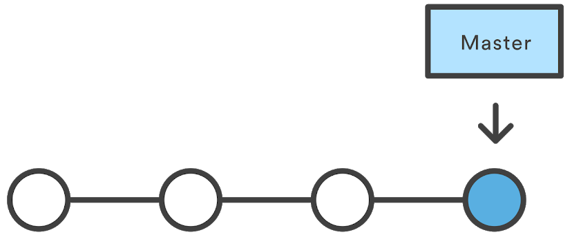

- everything is **up-to-date** with origin/main

- our **working tree** is clean

---

# Working Trees

Git tracks files, and keeps track of your history in 3 trees:


When you work locally, you are modifying the **Working Tree**. Your files will either be:
- **untracked**
- **modified**
- **staged**
- **committed**.

---

Now it is time to **create a file** in your local folder then, with your favorite editor (VSCode), **add a line of text** and save your file.

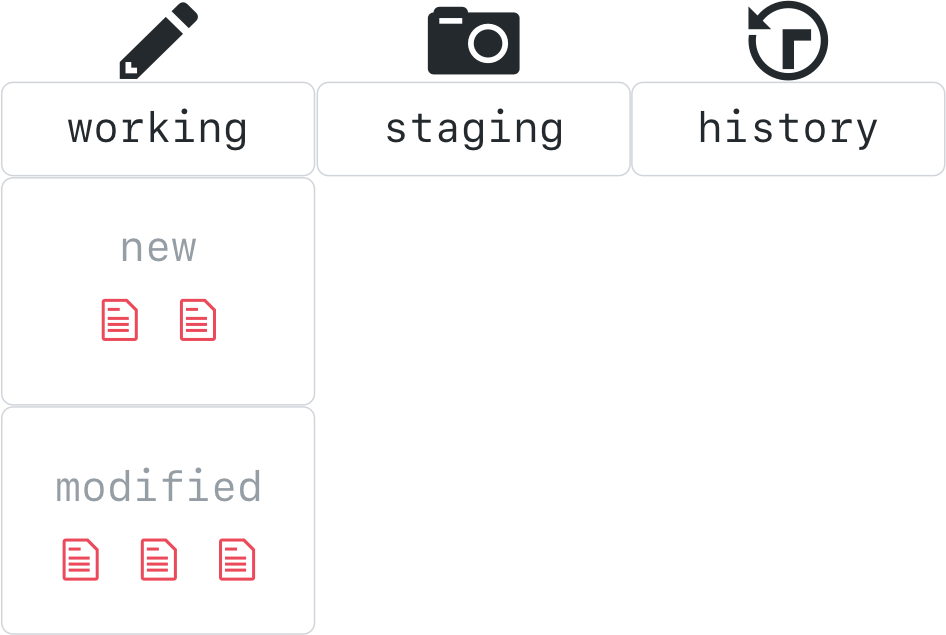

---

## The two stage commit: 1. Stage changes

It is time to create your first snapshot of the repository. 
First, `$ git add .` add your edits (tracked and untracked files) to the staging area.

        Use `git reset HEAD` to remove files from staging area - more on this later

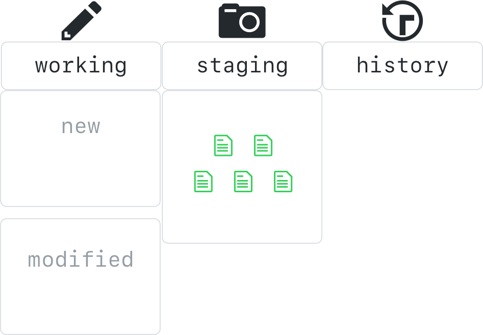

---

### The two stage commit: 2. Commit


`git commit -m "first commit"` This take a snapshot of the unit of work staged.
`-m`: add message, otherwise Vim will show up asking for a message
`-a`: automatically stage all tracked files, does not apply to new files
`-amend`: include staged changes in last commit

    In Vim press `Esc` and then type `:q` to quit; `:w` to save; `:x` to save and exit

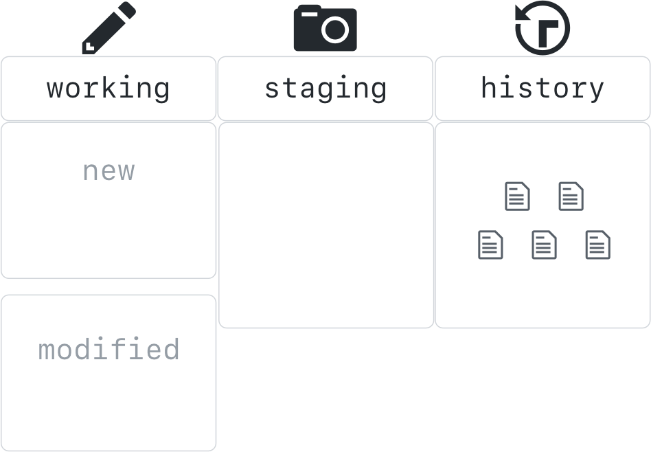

---

# Commit Message

Good commit messages should:

 - Be short. ~50 characters is ideal.
 - Describe the change introduced by the commit.
 - Tell the story of how your project has evolved.

---

# Activity:  Commit

1. let's check the status of our working tree: 
```shell
$ git status
```
2. Move the file from the working tree to the staging area:
```shell
$ git add my-file.md
```
3. Let's see what happened: 
```shell
$ git status
```
4. Now let's take our first snapshot: 
```shell
$ git commit - m "<commit message>"
```

---

### Check commits history

```shell
$ git log
$ git log --oneline
$ git log --oneline --graph
$ git log --oneline --graph --decorate
$ git log --oneline --graph --decorate --all
$ git log --stat
$ git log --patch
```

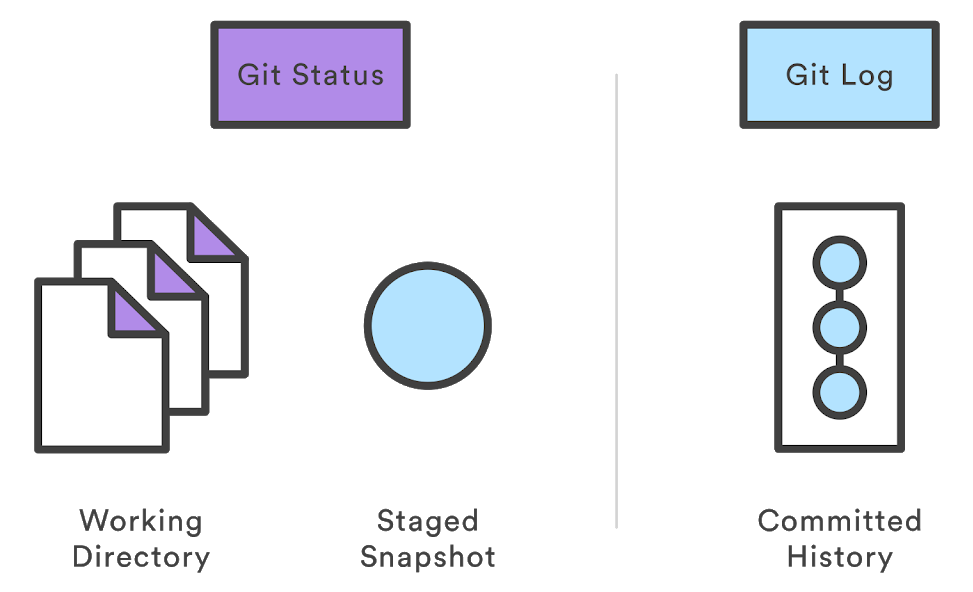

---

### Check differences

`git diff <hash> index.js `
`git diff main~` (1 commit before main)
`git diff main~~` (2 commits before main)
`git diff main~2` (2 commits before main)

> `git diff main^` (1 commit before main)
> `git diff main^^` (2 commits before main)
> `git diff main^2` (This is 1 commit back on second parent... see branching chapter)

---

# Activity:  let’s make a change and commit again.

- Add a line to the file then `$ git status​` (always good to do git status, never hurts). See our changes are NOT staged for commit. If you commit now, nothing will be committed.
- `$ git add .` then `$ git status​` now change is to be committed
- `$ git commit -m "your message"​`, then `$ git status`
- `$ git log --oneline`

```bash
$ git log --oneline
    8bca9ed (​HEAD -> main) your message
    7bba746 first commit
```

​What is this **HEAD** and **master** thing?

---

## *master* branch and *HEAD* pointer

```bash
$ git log --oneline
    8bca9ed (​HEAD -> main) second commit
    7bba746 first commit
```


In git, a **​branch​ is a pointer to a commit**, and it has a readable name. When you start a git repo, git creates a default branch called **main**. ​Git also has a pointer called **HEAD**, which **points to current commit**, initially, *main*.

When you commit, git not only creates a new commit but advances the branch pointer to point to the new commit. So, after a commit on the master branch, git advances the master pointer to the new commit, while HEAD keeps pointing to master.

---

## Navigating the commit history

You can use `​git switch` (or old-fashioned `​git checkout​`) to revert back your working directory to a previous commit.

`git switch <branch name or hash>`
`git switch main^` `git switch main~` (1 commit before main)
`git switch HEAD^` `git switch HEAD~` (1 commit ago)

Internally, it simply **moves the HEAD** (a pointer to the current commit) to point to the specified *​branch​ or commit*:
- when HEAD points to a **branch**, Git doesn't complain, but
- when you **switch to a commit**, it goes into a ***detached HEAD*** state.

---

# Activity: switch your working directory

- `$ git log --oneline​`

- `git switch <branch or hash>` or
  `git switch main^` `git switch main~` (1 commit before main)
  `git switch HEAD^` `git switch HEAD~` (1 commit ago)

- see we reverted the working directory to the previous state

- `$ git switch main` revert back to latest state

What if you do `git restore HEAD~ index.MD`?

---

## Restore your files from the history

```shell
$ git restore
````

> https://hub.packtpub.com/git-2-23-released-with-two-new-commands-git-switch-and-git-restore-a-new-tutorial-and-much-more/
> Two new commands **`git switch`** and **`git restore`** are introduced to split *"checking out a branch to work on advancing its history"* and *"checking out paths out of the index and/or a tree-ish to work on advancing the current history"* out of the single **`git checkout`** command.

---

# Ignoring files - .gitignore

Git sees every file in your working copy as one of three things:
1. **tracked** - a file which has been previously staged or committed;
2. **untracked** - a file which has not been staged or committed; or
3. ***ignored*** - a file which Git has been ​explicitly​ told to ignore.

Ignored files are usually build artifacts and machine generated files that can be derived from your repository source or should otherwise not be committed. 
​There is no explicit git ignore command​: ​instead the .gitignore file must be edited and committed by hand when you have new files that you wish to ignore.​ A an example your .gitignore file may be: node_modules, build, .log, .env, .DS_Store ...

> A collection of useful .gitignore templates https://github.com/github/gitignore

---

## Ignoring a file that you've committed in the past

If you want to ignore a file that you've committed in the past, you'll need to delete the file from your repository and then add a .gitignore rule for it. Using the --cached option with git rm means that the file will be deleted from your repository, but will remain in your working directory as an ignored file.
    
    echo debug.log >> .gitignore
    git rm --cached debug.log
    git commit -m "Start ignoring debug.log"

You can omit the --cached option if you want to delete the file from both the repository and your local file system.

---

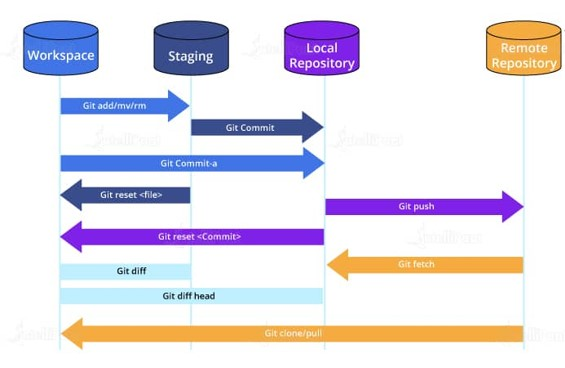

---

# Branching and merging

---

# Branching


---

### Create a branch

Modify files then create a new branch, stage and commit changes.

`git branch newFunction`
`git switch newFunction`

Alternatively:

`git switch -b newFunction`
`git commit -am "commit in the new branch"`
`git log`

### Delete a branch

`git branch -d newFunction`

---

## Fast-forward merge

`git switch master`

`git merge newFunction`

`git log --graph --decorate --oneline`

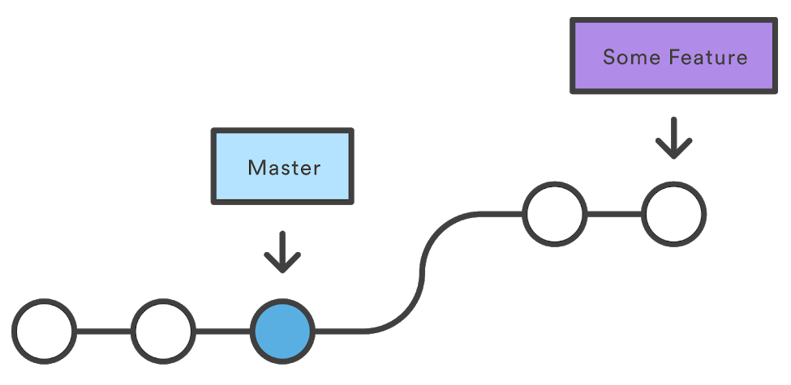

---

## Three-way merge

A fast-forward merge is not possible if the branches have diverged.
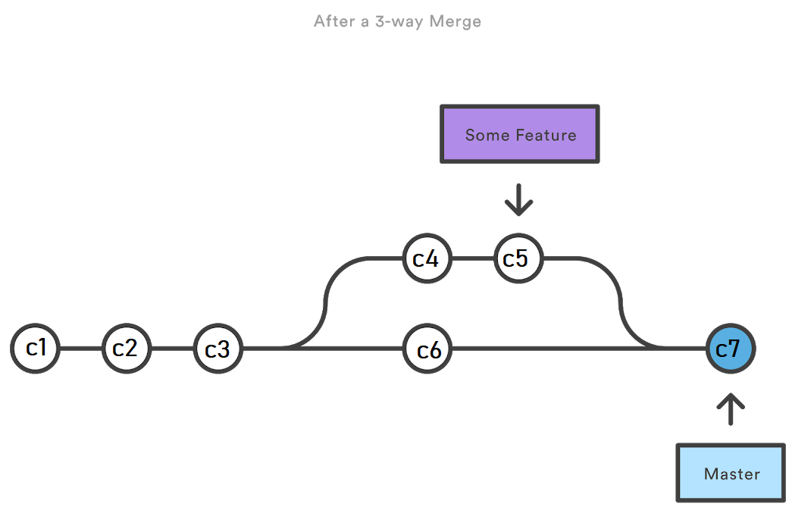
`main^` is the first parent of main: c6
`main^2` is the second parent of main: c5 (Some Feature)

---

## Conflicts in 3-way merge `git mergetool`

```javascript
    ...
    <<<<<<< HEAD
    "name": "branch-master",
    =======
    "name": "new-feature",
    >>>>>>> newFeature
    "version": "1.0.0",
    ...
```

#### P4Merge visual tool `git config merge.tool p4merge`

https://www.perforce.com/products/helix-core-apps/merge-diff-tool-p4merge

#### Visual studio Code to resolve conflicts - `conflicts highlighted`

---

### Try

- create a branch `git branch newport`
- modify readme on branch
`git add .` `git commit -m "add readme"`
`git log --graph --decorate --oneline ​(notice HEAD and master and branch)`
- move on newport `git switch newport`
- modify app.js
`git add .` `git commit -m "change port to 3001"`
- move on master `git switch master`
- merge `git merge newport ​- editor will open for commit message. just save.`

How can we create a merge conflict?

---

## Hands-on

Learn Git Branching - **learngitbranching.js**
- Introduction Sequence 1, 2, 3
- Ramping Up 1, 2, 3

> https://learngitbranching.js.org/?locale=en_US

---

# Collaboration

https://www.atlassian.com/git/tutorials/syncing

---

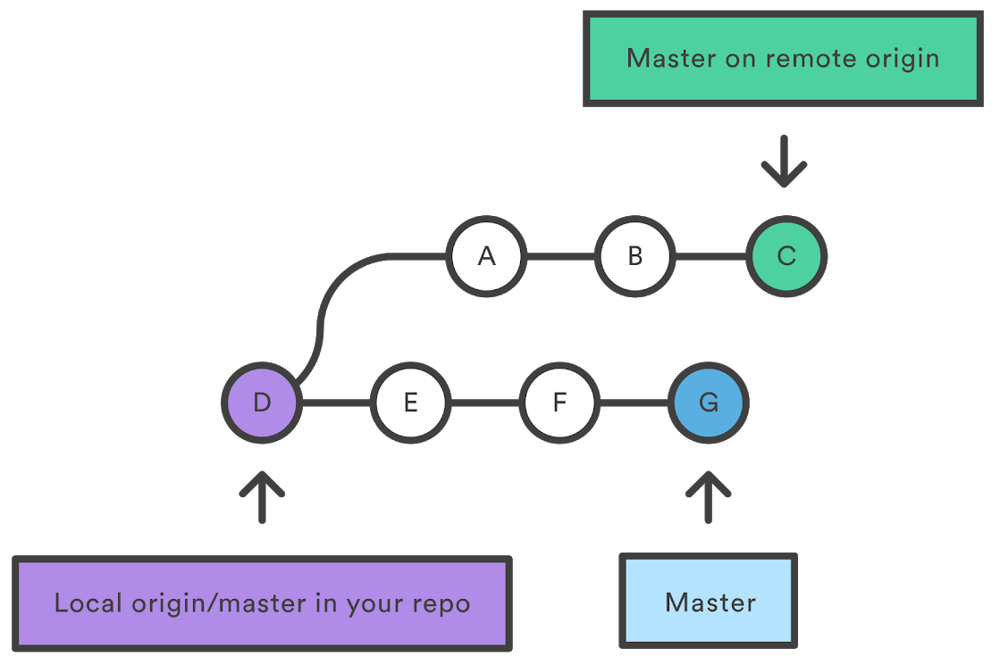

---

## Set up your GitHub.com account

1. Access https://github.com/ and click Sign up
2. Choose the free account, use the @unitn mail to get premium features 
3. You will receive a verification email at the address provided
4. Click the link to complete the verification process

---

### Clone with HTTPS

1. On github.com create a github repository

1. Clone repository with HTTPS in a local directory

    `git clone [https://github.com/user/repo] [localDestFolder]`

    > **NOTE**: many corporate networks restrict SSH traffic, so we highly recommend using HTTPS. Also, if you have two-factor authentication enabled and wish to use HTTPS, you will need to [set up a personal access token](https://docs.github.com/github/authenticating-to-github/accessing-github-using-two-factor-authentication#using-two-factor-authentication-with-the-command-line).

1. Check differences with remote repository
    
    `git diff origin master index.js `

---

### Pull changes

`git pull`

### Fetching changes without merging

`git fetch origin master`

`git branch -a`

### Push changes to remote repository

`git push origin master`

---

Before and after a pull with a three-way merge:

 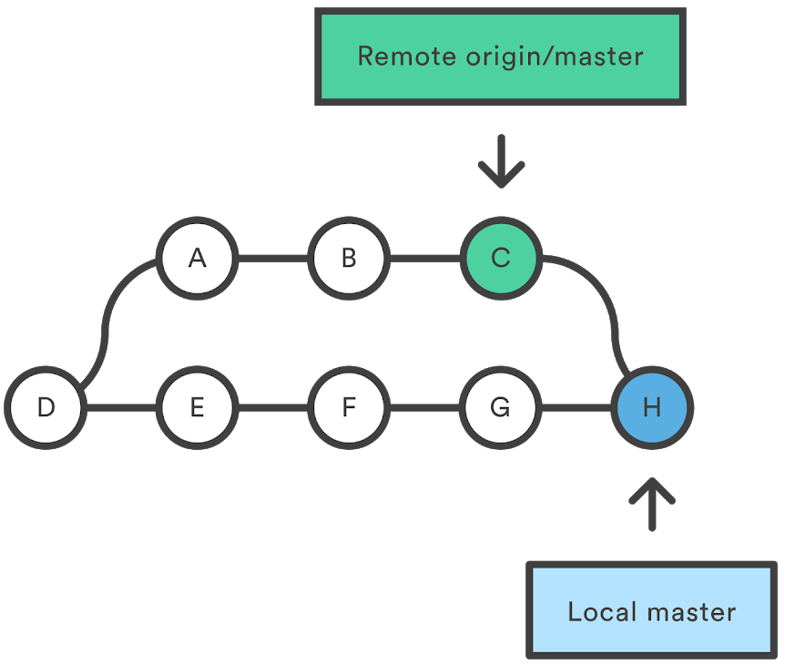

---

### Git remote

`git remote -v`

`git remote add <name> <url>`

### Delete remote branch

`git branch -d [branch_name]` (delete only local branch)

`git push origin -d [branch_name]`

`git push origin :[branch_name]`

---

## Hands-on

Learn Git Branching - **learngitbranching.js** 
- Push & Pull -- Git Remotes! 1, 2, 3, 4
- To Origin And Beyond -- Advanced Git Remotes! 1, 2, 3

> https://learngitbranching.js.org/?locale=en_US

---

# Advanced

    stash, rebase, tag, reset, revert ...

---

### Stashing changes before applying `git stash` `git stash pop`
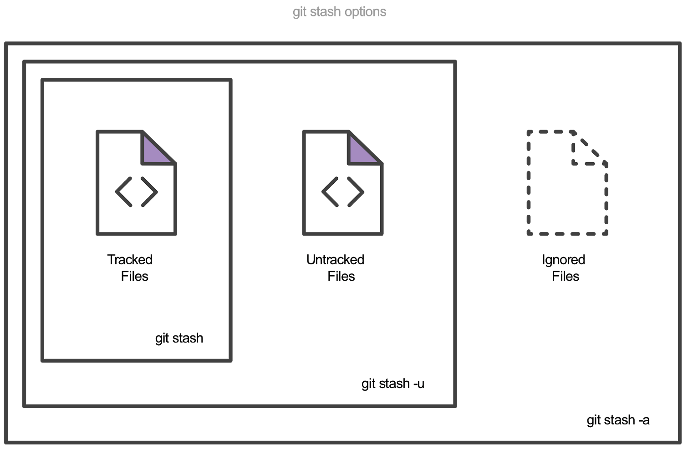

---

# Rebasing

`git rebase master` (commits in current branch are "re-applied" to the head of master)

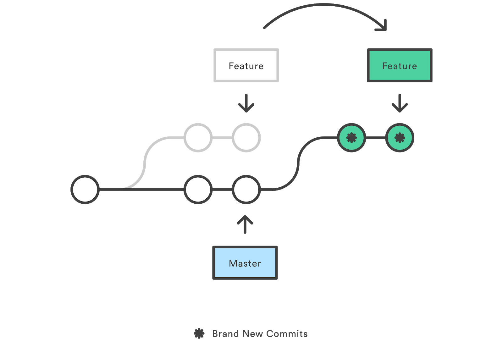

---

### Git Rebase Interactive

`git rebase -i master`

Commands:
p, pick = use commit
r, reword = use commit, but edit the commit message
e, edit = use commit, but stop for amending
s, squash = use commit, but meld into previous commit
f, fixup = like "squash", but discard this commit's log message
x, exec = run command (the rest of the line) using shell
d, drop = remove commit

---

### Try it yourself

- switch to master in an existing repo
- create a branch (say, somefeature)
- make a change and commit (on master)
- switch to somefeature
- make a change on somefeature (conflicting with master) and commit
- make another change on somefeature and commit
- make a third change on somefeature and commit
- then rebase, squashing the commit into one
- `git log --graph --decorate --oneline`

---

### Tagging

​Lightweight​ tag `git tag v1.0`

Annotated tag `git tag -a v1.4` store extra meta data such as: the tagger name, email, and date. A best practice is to consider Annotated tags as public, and Lightweight tags as private​. 

The -m option and a message `git tag -a v1.0 -m "my version 1.0"` will immediately create a new tag and forgot opening the local text editor.

To list stored tags in a repo: `git tag`

---

# Undoing Commits & Changes

---

### Reset - `git reset HEAD~2 <file>...`

- --soft – The staged snapshot and working directory are not altered in any way.
- --mixed – The staged snapshot is updated to match the specified commit, but the working directory is not affected. This is the default option.
- --hard – The staged snapshot and the working directory are both updated to match the specified commit.

For example, the following command moves the hotfix branch backwards by two commits. `git switch hotfix` `git reset HEAD~2`

---

### Revert - `git revert`

The git revert command can be considered an 'undo' type command, however, it is not a traditional undo operation. Instead of removing the commit from the project history, **it figures out how to invert the changes introduced by the commit and appends a new commit with the resulting inverse content**. This prevents Git from losing history, which is important for the integrity of your revision history and for reliable collaboration.

---

### Revert vs. reset

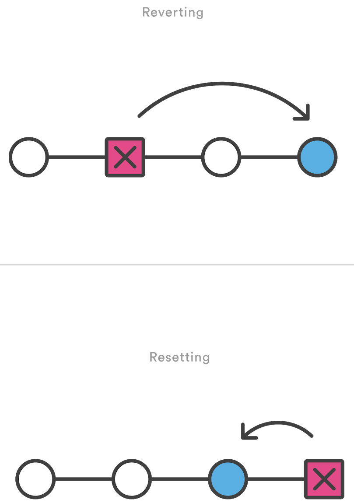

---

#### Try revert:

```
git init .
git add demo_file
git commit -am"initial commit"
echo "initial content" >> demo_file
git commit -am"add new content to demo file"
echo "prepended line content" >> demo_file
git commit -am"prepend content to demo file"
git log --oneline
    86bb32e prepend content to demo file
    3602d88 add new content to demo file
    299b15f initial commit
git revert HEAD
    [master b9cd081] Revert "prepend content to demo file"
    1 file changed, 1 deletion(-)
git log --oneline
    1061e79 Revert "prepend content to demo file"
    86bb32e prepend content to demo file
    3602d88 add new content to demo file
    299b15f initial commit
```

---

## Hands-on

Learn Git Branching - **learngitbranching.js**
- Main
    - Introduction Sequence: 4
    - Ramping Up: 4
    - Moving Work Around ...
    - A Mixed Bag ...
    - Advanced Topics ...
- Remote
    - Push & Pull -- Git Remotes! 5, 6, 7, 8
    - To Origin And Beyond -- Advanced Git Remotes! 4, 5, 6, 7, 8

> https://learngitbranching.js.org/?locale=en_US

---

# Questions?

marco.robol@unitn.it

---

# Additional material

> ### Cheat sheet https://www.atlassian.com/git/tutorials/atlassian-git-cheatsheet

> ### `gitk` Integrated UI 
> ### `rebase` https://git-scm.com/docs/git-rebase
> ### `patch` https://www.specbee.com/blogs/how-create-and-apply-patch-git-diff-and-git-apply-commands-your-drupal-website

> ### Learn Git Branching https://learngitbranching.js.org/?locale=en_US
> ### An open source game about learning Git https://ohmygit.org/
