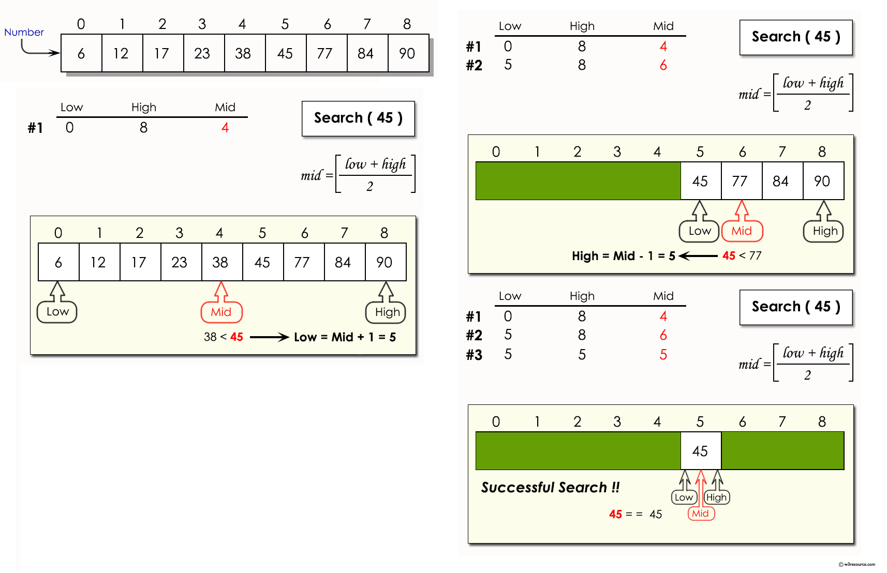

# **Javascript Basics - Hands-on**

Software Engineering

#### Marco Robol - marco.robol@unitn.it

*Academic year 2022/2023 - Second semester*

---

# Javascript Basics - Recap

> https://javascript.info/first-steps
> Types, Functions, Control flow statements, Objects and Classes

---

### Callback-based array methods `.forEach` `.map` `.reduce` `.filter` `.find`

A **callback** is a **function passed as argument to another function** and later invoked with arguments as decided by the invoking function.

```javascript
[1,2,3].forEach( console.log )                  // reference to existing function

[1,2,3].forEach( v=>console.log(v) )            // anonymous callback as arrow function

[1,2,3].forEach( function(v) {console.log(v)} ) // anonymous callback as function expression
```

The callback may be invoked different times or at given events, *we will go more in details on this when introducing asynchronous programming*.

```javascript
( a, b ) => {       // Arrow Function (+args +instructions)
    let r = a % b;
    return r;
}
a => a * a         // Arrow Function (1arg 1instruction, no return needed)
```
---

### Scope of variables (& constants): global, block, function

```javascript
const global_const = 'global_const';  // globally-scoped constant
var global_var = 'global_var';        // globally-scoped variable

function myFn () {
    
    console.log(global_const)         // 'global_const'
    console.log(global_var)           // 'global_var'

    if ( true ) {
        const constant = 'constant';  // block-scoped constant
        let local = 'local';          // block-scoped (local) variable
        var variable = 'variable';    // function-scoped variable
    }

    console.log(constant)             // ReferenceError
    console.log(local)                // ReferenceError
    console.log(variable)             // 'variable'
}

console.log(variable)                 // ReferenceError
```

---

### `this` keyword

> `this` keyword behaves a little differently in JavaScript compared to other languages. In most cases, the value of this is determined by how a function is called (runtime binding) and it may be different each time the function is called. The bind() method can set the value of a function's this regardless of how it's called, and arrow functions don't provide their own this binding (it retains the this value of the enclosing lexical context). See [.bind()](https://developer.mozilla.org/en-US/docs/Web/JavaScript/Reference/Global_Objects/Function/bind) and [.call()](https://developer.mozilla.org/en-US/docs/Web/JavaScript/Reference/Global_Objects/Function/call)

```javascript
function sum (a) {
    return this + a;
}

var bindedSum = description.bind(2);
bindedSum(3); // 6

description.call(2,3) // 6
```

---

## Hands-on

Arrays: n3 and n8 - https://medium.com/@andrey.igorevich.borisov/10-javascript-exercises-with-arrays-c44eea129fba

Functions: n18 - https://www.w3resource.com/javascript-exercises/javascript-functions-exercises.php

---

#### Es 1 - Arrays - Compact - Write a method that clears array from all unnecessary elements, like false, undefined, empty strings, zero, null

```javascript
/** 
  * Task description: Write a method that clears array from all
  * unnecessary elements, like false, undefined, empty strings, zero, null 
  * Expected Result: [0, 1, false, 2, undefined, '', 3, null] => [1, 2, 3] 
  * Task Complexity: 1 of 5 
  * @param {Array} array - An array of any elements 
  * @returns {Array} 
*/
const compact = (array) => {
 throw new Error('Put your solution here');
}
const data = [0, 1, false, 2, undefined, '', 3, null];
console.log(compact(data)) // [1, 2, 3]
```
> https://medium.com/@andrey.igorevich.borisov/10-javascript-exercises-with-arrays-c44eea129fba Es 3

---

#### Es 2 - Arrays - Flatten - Write a function that turns a deep array into a plain array. Please, do not use array.flat(); to make this task more enjoyable.

```javascript
/** 
  * Task description: Write a method that turns a deep array into a plain array 
  * Expected Result: [1, 2, [3, 4, [5]]] => [1, 2, 3, 4, 5] 
  * Task complexity: 3 of 5 
  * @param {Array} array - A deep array 
  * @returns {Array} 
*/
const flatten = (array) => {
 throw new Error('Put your solution here');
}
const data = [1, 2, [3, 4, [5]]];
console.log(flatten(data)); // [1, 2, 3, 4, 5]
```
> https://medium.com/@andrey.igorevich.borisov/10-javascript-exercises-with-arrays-c44eea129fba Es 8

---

#### Es 3 - Functions - Write a function for searching JavaScript arrays with a binary search

Note : A binary search searches by splitting an array into smaller and smaller chunks until it finds the desired value.

> https://www.w3resource.com/javascript-exercises/javascript-functions-exercises.php Es 18

---



---

# Asyncronous programming - Recap

```javascript
setTimeout(()=>{
    console.log('1000ms');         // 1000ms 
    setTimeout(()=>{
            console.log('5000ms')  // 5000ms 
        }, 5000)                   // then, wait for another 5 seconds
}, 1000)                           // first, wait 1 second 
```

... next we will see how to improve readability of asynchronous programming with *promises* and *async/await*.

---

## Hands-on

Javascript promises - mastering the asynchronous - **codingame.com**
> Steps 1 to 4: https://www.codingame.com/playgrounds/347/

---

### Promises - Recap
Suppose we want a sequence of timeouts. With callback-based setTimeout() we have:

```javascript
setTimeout(()=>{
    console.log('1000ms');         // 1000ms 
    setTimeout(()=>{
            console.log('5000ms')  // 5000ms 
        }, 5000)                   // then, wait for another 5 seconds
}, 1000)                           // first, wait 1 second 
```

```javascript
// We can promisify the setTimeout API as follows:
promisifiedTimeout = function (time) {
    return new Promise( (res) => setTimeout( ()=>res(time+'ms'), time) ) 
}
```
```javascript
promisifiedTimeout(1000)                                  // first wait for 1 second
.then( resolvedValue=>console.log(resolvedValue) )        // '1000ms'
.then( resolvedValue=>{return promisifiedTimeout(5000)} ) // then wait for additional 5
.then( console.log )                                      // '5000ms'
```

---

### Asynch/await - Recap

```javascript
setTimeout(()=>{
    setTimeout(()=>{
            console.log('done')                     // done
        }, 5000)                                    // then wait for another 5 seconds
}, 1000)                                            // first wait 1 second 
```
```javascript
function example() {
    promisifiedTimeout(1000)                     // first wait for 1 second
    .then(()=>{return promisifiedTimeout(5000)}) // then wait for additional 5
    .then(()=>console.log('done');)              // done
}
```
```javascript
async function asyncExample() {
    await promisifiedTimeout(1000);              // first wait for 1 second
    await promisifiedTimeout(5000);              // then wait for additional 5
    console.log('done');                         // done
}
```

---

## Hands-on

Javascript promises - mastering the asynchronous - **codingame.com**
> Steps 5 to 17: https://www.codingame.com/playgrounds/347/

---

# Questions?

marco.robol@unitn.it