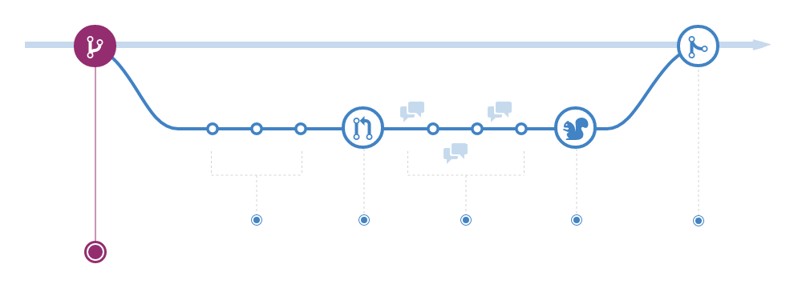

<!-- _class: home -->

# **Git workflows and GitHub flow**

Software Engineering - Lab

#### Marco Robol - marco.robol@unitn.it

---

# Contents

- Git workflows:
  - Centralized Workflow
  - Feature Branch Workflow
  - Gitflow Workflow
  - Forking Workflow
- GitHub flow

### Tools and references

- Git (https://git-scm.com/downloads)
- Visual Studio Code (https://code.visualstudio.com/)
- GitHub (https://github.com)

---


### Centralized Workflow

In this flow, the default development branch is called master and all changes are committed into this branch​. ​This workflow doesn’t require any other branches besides master​.


---

Tip:

`git pull --rebase origin master`

The pull would still work if you forgot this option, but you would wind up with a superfluous “merge commit” every time someone needed to synchronize with the central repository. For this workflow, it’s always better to rebase instead of generating a merge commit.

---

### Git Feature Branch Workflow

The core idea behind the Feature Branch Workflow is that all feature development should take place in a dedicated branch instead of the master branch.​ ​This encapsulation makes it easy for multiple developers to work on a particular feature without disturbing the main codebase. It also means the master branch will never contain broken code, which is a huge advantage for continuous integration environments.


---

### Gitflow Workflow

https://www.atlassian.com/git/tutorials/comparing-workflows

The Gitflow Workflow defines a strict branching model designed around the project release. This provides a robust framework for managing larger projects.

This workflow doesn’t add any new concepts or commands beyond what’s required for the ​Feature Branch Workflow​. Instead, it assigns very specific roles to different branches and defines how and when they should interact. In addition to feature branches, it uses individual branches for preparing, maintaining, and recording releases.

---


---

The ​master​ branch stores the official release history, and the ​develop​ branch serves as an integration branch for features. It's also convenient to tag all commits in the master branch with a version number.

Features should never interact directly with master.

Once develop has acquired enough features for a release (or a predetermined release date is approaching), you fork a release branch off of develop​. ​Creating this branch starts the next release cycle, so no new features can be added after this point—only bug fixes, documentation generation, and other release-oriented tasks should go in this branch​. ​Once it's ready to ship, the release branch gets merged into master and tagged with a version number. In addition, it should be merged back into develop, which may have progressed since the release was initiated.

Maintenance or “hotfix” branches are used to quickly patch production releases.

---

### Forking Workflow

As in the other ​Git workflows​, the Forking Workflow begins with an official public repository stored on a server. But when a new developer wants to start working on the project, they do not directly clone the official repository. Instead, they ​fork​ the official repository to create a copy of it on the server.

It's important to note that "forked" repositories and "forking" are not special git operations. Forked repositories are created using the standard ​git clone​ command. Forked repositories are generally "server-side clones" and usually managed and hosted by a 3rd party Git service.

---

# GitHub flow



---

# Understanding the GitHub flow

In addition to being a place to host and share your Git projects, GitHub provides a number of features to help you and your team collaborate more effectively.

1. In GitHub, you will use issues to record and discuss ideas, enhancements, tasks, and bugs.

2. When you are ready to experiment with a **new feature** or **fix an issue**, you create a **new branch "feature"** branch.

3. When you are ready to start a discussion about your changes, you will open a **pull request**. A pull request doesn't need to be a perfect work of art - it is meant to be a starting point that will be further refined and polished through the efforts of the project team.

4. When the changes contained in the pull request are approved, the feature branch is **merged** onto the main branch.

---

## Activity: Creating a GitHub Issues

In GitHub, you will use issues to record and discuss ideas, enhancements, tasks, and bugs.

1. In the Issues tab click New Issue.
2. Type the following in the Subject line: YOUR-USERNAME Workflow
3. In the body of the issue, include the text below:
```YOUR-USERNAME will update a file by replacing a caption.
- [ ] Create a branch
- [ ] Edit the file
- [ ] Commit the changes
- [ ] Create a Pull Request
- [ ] Request a Review
- [ ] Make more changes
- [ ] Get an approval
- [ ] Merge the Pull Request
```
4. Click the Submit new issue button to open your issue.

---

### Using Markdown
GitHub uses a syntax called **Markdown** to help you add basic text formatting to Issues, Pull Requests, and files with the .md extension. Commonly used Markdown syntax:

`# Header` The # indicates a Header. # = Header 1, ## = Header 2, etc.

`- List item` A single * or - followed by a space will create a bulleted list.

`**Bold item**` Two asterisks ** on either side of a string will make that text bold.

`- [ ] Checklist` A - followed by a space and [ ] will create a handy checklist in your issue or pull request.

`@mention` When you @mention someone in an issue, they will receive a notification - even if they are not currently subscribed to the issue or watching the repository.

`#975` A # followed by the number of an issue or pull request (without a space) in the same repository will create a cross-link.

---

## Activity: Creating a branch with GitHub

Earlier you created an **issue** about the file you would like to edit. Let's **create the branch** you will use to edit your file.

- Navigate to Code tab of the class repository.
- Click the branch dropdown.
- Enter the branch name github-username-caption.
- Click on your branch name to create the branch.

## Activity: Start change your file

Now that you have started to change your file, you will open a pull request to discuss the file with your teammates. 

---

## Activity: Creating a pull request

Pull Requests are used to propose changes to the project files. It introduces an action that addresses an Issue. It is considered a "work in progress" until it is merged into the project.

1. In the **Pull Request** tab click **New Pull Request**.
2. In the **base** dropdown, choose **main**. In the **compare** dropdown, choose **your branch**.
3. Type a subject line and enter a comment. Use Markdown formatting to add a header and a checklist to your Pull Request.
4. Include one of the keywords: **closes**, **fixes**, or **resolves** followed by the **issue number** you created earlier to note which Issue the Pull Request should close. 
    > Example: **This resolves #3**
8. Click **Preview** to see how your Pull Request will look.
9. Assign the Pull Request to yourself.
10. Select your partner as a Reviewer for the Pull Request.
11. Click **Create pull request**.

---

# Activity: Code review

One of the best ways to ensure code quality is to make peer reviews a part of every Pull Request. Let's review your partner's code now:

1. In the **Pull Request** tab use the **Author** drop down to your partner's pull request.
3. Click the **Files Changed** tab.
4. Hover over a single line in the file to see the blue +. Click the + to add a line comment.
5. Comment on the line and click **Start a review**.
6. Add additional line comments to the pull request.
7. Click **Review changes** in the top right corner.
8. Choose whether to **Approve** or **Request changes**.
9. Enter a general comment for the review.
10. Click **Submit review** then click the **Conversation** tab to check out completed review.

---

# Merging pull requests

- When you merge your branch, you are taking the content and history from your feature branch and adding it to the content and history of the main branch.


--- 

# Merging pull requests

Many project teams have established rules about who should merge a pull request.

- Some say it should be the person who created the pull request since they will be the ones to deal with any issues resulting from the merge.
- Others say it should be a single person within the project team to ensure consistency.
- Still others say it can be anyone other than the person who created the pull request to ensure at least one review has taken place.


---

# Merging your pull request

1. Navigate to your Pull Request
2. Click **Conversation**
3. Scroll to the bottom of the Pull Request and click the **Merge pull request** button
4. Click **Confirm merge**
5. Click **Delete branch**
6. Click **Issues** and confirm your original issue has been closed

---

# Questions?

marco.robol@unitn.it

