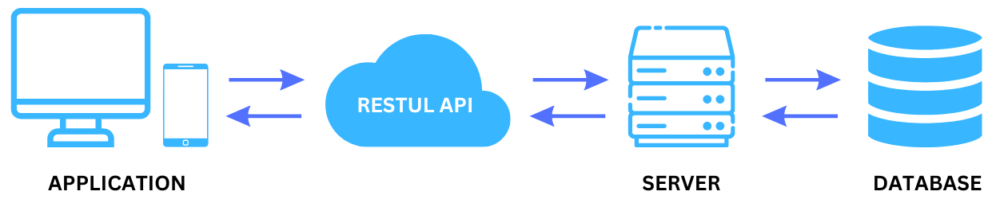

# **RESTful WebAPIs**

Software Engineering - Lab

#### Marco Robol - marco.robol@unitn.it

*Academic year 2023/2024 - Second semester*

---

## RESTful WebAPIs

- An **API** stands for an application programming interface. It defines how applications or devices can connect to and communicate with each other.
- **REST** (Representational State Transfer) is an architectural style for APIs that use HTTP method to access and manipulate web resources using a uniform and predefined set of stateless operations. (Source [wikipedia](https://en.wikipedia.org/wiki/Representational_state_transfer) and [restful-api.dev](https://restful-api.dev/rest-fundamentals#rest-api))



---

## RESTful concepts

> A complete guide to RESTful [www.restapitutorial.com](https://www.restapitutorial.com/)

- **Resources**: Web resources can be identied by an URI (universal resource identifier - urls are the most common type of identifiers).

- **Representation**: json, xml, ...

- **Operations**: CRUD operations are mapped to the standard HTTP verbs

For example, given a RESTful API for managing products, the http request `GET /api/products` would return:
```json
{ "id" : 1,
  "name" : "iPhone XL",
  "description" : "Extra large"
}
```

---

## Operations

CRUD operations are mapped to the standard HTTP verbs. In our example we will have that: 

| Operation | HTTP Verb    |   URI          |   Req body  | Resp body  | success |
|-----------|--------------|----------------|-------------|------------|---------|
| Search    |  GET         | /products      |  Empty      | [Product+] |   200   |
| Create    |  POST        | /products      |  Product    | Product    |   201   |
| Read      |  GET         | /products/:id  |  Empty      | Product    |   200   |
| Update    |  PUT / PATCH | /products/:id  |  Product*   | Product    |   200   |
| Delete    |  DELETE      | /products/:id  |  Empty      | Empty      |   204   |

---

## Status codes

Using status code in RESTful APIs: https://www.restapitutorial.com/lessons/httpmethods.html

A complete list of HTTP status code: [restapitutorial.com/httpstatuscodes.html](https://www.restapitutorial.com/httpstatuscodes.html)

---

## Links

Complex APIs require special attention to the relationship between web resources, and ways of traversing the relationships. The same resource could be accessed under different URLs. For example, to get the list of products associated to a company (`/company/:id/products`).

To easily navigate through resources, we should use links in place of ids. For example:

```json
// GET /products/123 JSON:
{ "self": "/products/123", "name": "iPhone", "producer": "/company/456" }

// GET /company/456 JSON:
{ "self": "/company/456", "name": "Apple", "products": "/products?producer=/company/456" }
```

> ***Read the following article:*** [API design: Why you should use links, not keys, to represent relationships in APIs
](https://cloud.google.com/blog/products/application-development/api-design-why-you-should-use-links-not-keys-to-represent-relationships-in-apis)

---

## Let's check out existing RESTful APIs on the web

Use [Postman](https://www.postman.com) to test RESTful APIs at [restful-api.dev](https://restful-api.dev)

1. https://jsonplaceholder.typicode.com/ Fake REST APIs for testing and prototyping;
2. https://cloud.google.com/translate/docs?hl=it Google Translations APIs;
3. https://openweathermap.org/api Open Weather Map;
4. https://restcountries.com/ REST Countries;
5. https://ipapi.co/ IP API provides you with information about an IP address;
6. https://random-data-api.com/ Random Data API;
7. https://pokeapi.co/ The Pokemon API is a simple API for Pokemon;

> https://dev.to/ruppysuppy/7-free-public-apis-you-will-love-as-a-developer-166p

---

## EasyLib

Web service for the management of book lendings to students.

> Repository: https://github.com/unitn-software-engineering/EasyLib

> APIs documentation: https://easylib.docs.apiary.io/#

---

# Questions?

marco.robol@unitn.it