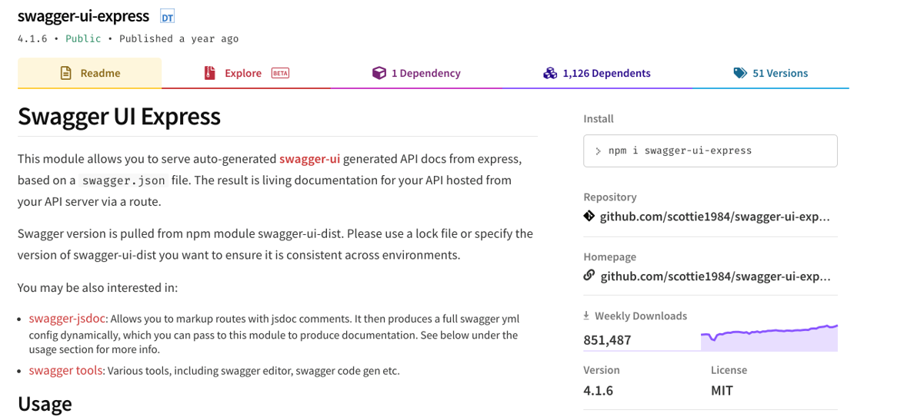
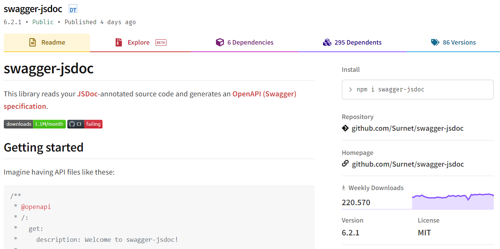

# **Designing and Documenting RESTful APIs with OpenAPI Specification Language**

Software Engineering - Lab

#### Marco Robol - marco.robol@unitn.it

---

# OpenAPI Specification Language

> ***Online documentation:*** https://swagger.io/docs/specification/v3_0/about

OpenAPI Specification (formerly Swagger Specification) is an API description format for REST APIs. An OpenAPI file allows you to describe your entire API, including: endpoints and operations, input and output parameters, authentication.

Use the following tools to document and test your APIs:
- https://editor.swagger.io/
- https://app.apiary.io/ (No support for v3.0!)
- https://www.postman.com/

---

## Basic Structure

A sample OpenAPI 3.0 definition written in YAML looks like:

```yaml
openapi: 3.0.0
info:
  title: Sample API
  description: Optional multiline or single-line description in [CommonMark](http://commonmark.org/help/) or HTML.
  version: 0.1.9

servers:
  - url: http://api.example.com/v1
    description: Optional server description, e.g. Main (production) server
  - url: http://staging-api.example.com
    description: Optional server description, e.g. Internal staging server for testing

paths:
  /users:
    get:
      summary: Returns a list of users.
      description: Optional extended description in CommonMark or HTML.
      responses:
        "200": # status code
          description: A JSON array of user names
          content:
            application/json:
              schema:
                type: array
                items:
                  type: string
```

All keyword names are **case-sensitive**.

---

### Metadata

The OpenAPI version defines the overall structure of an API definition – what you can document and how you document it.

```yml
openapi: 3.0.0
```

The `info` section contains API information: `title`, `description` (optional), `version`:

```yaml
info:
  title: Sample API
  description: Optional multiline or single-line description in [CommonMark](http://commonmark.org/help/) or HTML.
  version: 0.1.9
```

---

### Servers

The `servers` section specifies the API server and base URL. You can define one or several servers, such as production and sandbox.

```yml
servers:
  - url: http://api.example.com/v1
    description: Optional server description, e.g. Main (production) server
  - url: http://staging-api.example.com
    description: Optional server description, e.g. Internal staging server for testing
```

All API paths are relative to the server URL. In the example above, `/users` means `http://api.example.com/v1/users` or `http://staging-api.example.com/users`, depending on the server used. For more information, see [API Server and Base Path](/docs/specification/api-host-and-base-path/).

---

### Paths

API paths are defined in the global `paths` section of the API specification.

```yaml
paths:
  /ping: ...
  /users: ...
  /users/{id}:
    summary: Represents a user
    description: >
      This resource represents an individual user in the system.
      Each user is identified by a numeric `id`.
    get: ...
    delete: ...
```

All paths are relative to the [API server URL](/docs/specification/api-host-and-base-path/). The full request URL is constructed as `<server-url>/path`. Paths may have an optional short `summary` and a longer `description` for documentation purposes. `description` can be [multi-line](http://stackoverflow.com/questions/3790454/in-yaml-how-do-i-break-a-string-over-multiple-lines) and supports [Markdown](http://commonmark.org/help/) (CommonMark) for rich text representation.

---

## Operations

The `paths` section defines individual endpoints (paths) in your API, and the **HTTP methods** (operations) supported by these endpoints. A single path can support multiple operations, for example `GET /users` to get a list of users and `POST /users` to add a new user. For example, `GET /users`:

```yaml
paths:
  /users:
    get:
      summary: Returns a list of users.
      description: Optional extended description in CommonMark or HTML
      responses:
        "200":
          description: A JSON array of user names
          content:
            application/json:
              schema:
                type: array
                items:
                  type: string
```

---

### Operation Parameters

OpenAPI 3.0 supports operation parameters passed via **path**, **query string**, **headers**, and **cookies**. You can also define the request body for operations that transmit data to the server, such as POST, PUT and PATCH. For details, see [Describing Parameters](/docs/specification/describing-parameters/) and [Describing Request Body](/docs/specification/describing-request-body/describing-request-body/).

---

### Path Templating

You can use curly braces `{}` to mark parts of an URL as [path parameters](/docs/specification/describing-parameters/#path-parameters):

```yaml
/users/{id}
/organizations/{orgId}/members/{memberId}
/report.{format}
```

The API client needs to provide appropriate parameter values when making an API call, such as `/users/5` or `/users/12`.

---

### Query String in Paths

Query string parameters **must not** be included in paths. They should be defined as [query parameters](/docs/specification/describing-parameters/#query-parameters) instead.

```yaml
# Incorrect
paths:
  /users?role={role}:
```

```yaml
# Correct
paths:
  /users:
    get:
      parameters:
        - in: query
          name: role
          schema:
            type: string
            enum: [user, poweruser, admin]
          required: true
```

---

## Describing Request Body

`requestBody` consists of the `content` object, an optional `description`, and an optional `required` flag (`false` by default). `content` lists the media types consumed by the operation (such as `application/json`) and specifies the `schema` for each media type. **Request bodies are optional by default**.

```yaml
paths:
  /pets:
    post:
      summary: Add a new pet
      requestBody:
        description: Optional description in *Markdown*
        required: true
        content:
          application/json:
            schema:
              $ref: "#/components/schemas/Pet"
      responses:
        "201":
          description: Created
```

---

# Components Section

You can define global common definitions and reference them using $ref.

```yaml
paths:
  /users/{userId}:
    get:
      summary: Get a user by ID
      parameters: ...
      responses:
        "200":
          description: A single user.
          content:
            application/json:
              schema:
                $ref: "#/components/schemas/User"
components:
  schemas:
    User:
      type: object
      properties:
        id:
          type: integer
        name:
          type: string
```

---

> Continue reading at https://swagger.io/docs/specification/v3_0/about/

---

## EasyLib/oas3.yaml 1/3

> Repository: https://github.com/unitn-software-engineering/EasyLib
> APIs documentation: https://easylib.docs.apiary.io/#

```yaml
openapi: 3.0.0
info:
  version: '1.0'
  title: "EasyLib OpenAPI 3.0"
  description: API for managing book lendings.
  license:
    name: MIT
servers:
  - url: http://localhost:8000/api/v1
    description: Localhost
paths:
  ...
components:
  ...
```

---

## EasyLib/oas3.yaml 2/3

```yaml
paths:
  /booklendings:
    post:
      description: >-
        Creates a new booklending.
      summary: Borrow a book
      responses:
        '201':
          description: 'Booklending created. Link in the Location header'
          headers:
            'Location':
              schema:
                type: string
              description: Link to the newly created booklending.
      requestBody:
        content:
          application/json:
            schema:
              $ref: '#/components/schemas/Booklending'
```

---

## EasyLib/oas3.yaml 3/3

```yaml
components:
  schemas:
    Booklending:
      type: object
      required:
      - student
      - book
      properties:
        user:
          type: string
          description: 'Link to the user'
        book:
          type: integer
          description: 'Link to the book'
```

---

# Designing your RESTful APIs

Start from your user stories and provide RESTful APIs for each of them:

- Identify resources and define their structure
- Organize into main and sub-resources
- Define supported methods and accepted parameters / constraints 
- Define returned status codes

---

# Questions?

marco.robol@unitn.it

---

# [Swagger UI Express](https://www.npmjs.com/package/swagger-ui-express)



---

This module allows you to serve auto-generated swagger-ui generated API docs from express, based on a swagger.json file. The result is living documentation for your API hosted from your API server via a route.

```javascript
const express = require('express');
const app = express();
const swaggerUi = require('swagger-ui-express');
const swaggerDocument = require('./swagger.json');

app.use('/api-docs', swaggerUi.serve, swaggerUi.setup(swaggerDocument));
```

---

# [swagger-jsdoc](https://www.npmjs.com/package/swagger-jsdoc)



---

This library reads your JSDoc-annotated source code and generates an OpenAPI (Swagger) specification. Imagine having API files like these:

```javascript
/**
 * @openapi
 * /:
 *   get:
 *     description: Welcome to swagger-jsdoc!
 *     responses:
 *       200:
 *         description: Returns a mysterious string.
 */
app.get('/', (req, res) => {
  res.send('Hello World!');
});
```

---

The library will take the contents of @openapi (or @swagger) with the following configuration:

```javascript
const swaggerJsdoc = require('swagger-jsdoc');

const options = {
  definition: {
    openapi: '3.0.0',
    info: {
      title: 'Hello World',
      version: '1.0.0',
    },
  },
  apis: ['./src/routes*.js'], // files containing annotations as above
};

const openapiSpecification = swaggerJsdoc(options);
```

The resulting openapiSpecification will be a swagger validated specification.

---

# swagger-ui-express and swagger-jsdoc

Swagger specification auto-generated and served from express.

```javascript
const swaggerUI = require('swagger-jsdoc')
const swaggerJsDoc = require('swagger-ui-express')

const swaggerOptions = {
  definition: {
    openapi: '3.0.0',
    info: {
      title: 'Hello World',
      version: '1.0.0',
    },
  },
  apis: ['./src/routes*.js'], // files containing annotations as above
};

const swaggerDocument = swaggerJsDoc(swaggerOptions);
app.use('/api-docs', swaggerUi.serve, swaggerUi.setup(swaggerDocument));
```
