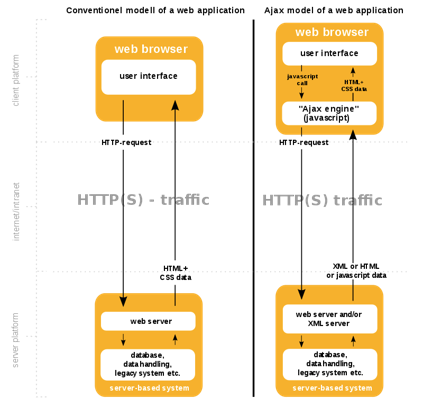
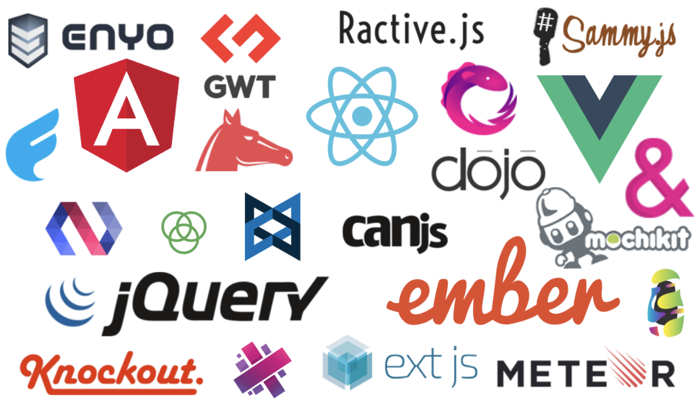
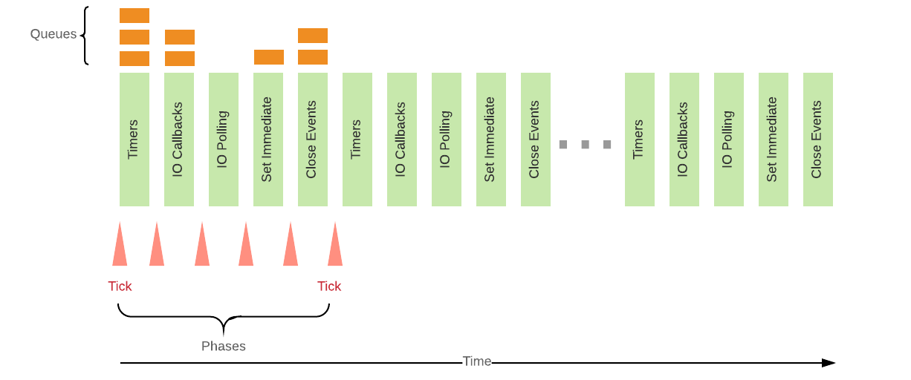
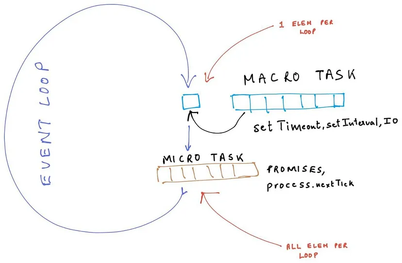

# **Introduction to Web2.0, Javascript and Node.js**

Software Engineering

#### Marco Robol - marco.robol@unitn.it

*Academic year 2024/2025*

---

# Contents

- Web2.0 - Technologies
- JavaScript and [Node.js](http://nodejs.org)
    - **Basics** - types, variables, loops, functions, classes
    - **Asynchronous programming** - Asynchronous programming, non-blocking callbacks, promises, async/await
    - **Package management with NPM** - Node Package Manager

In the next lab... how to implement a web service with Node.js [Express](https://expressjs.com/it/) web framework

---

## From Static Website to Web Applications and *Web Services*

- **Web 1.0** - Static content with HTML and hyperlinks. Interaction was only possible through HTML forms, where response pages were then generated on the server.

- **Web 2.0** - Javascript-based **web applications** powered by asynchronous HTTP requests APIs and DOM manipulation supported by most browser.
*Availability* - *Accessibility* - *Sharing* - *Compatibility*

---

## Asyncronous data retrieval and page modification 

By decoupling the data interchange layer from the presentation layer Web applications:
- **send and retrieve data from a server asynchronously** (in the background) without interfering with the display and behaviour of the existing page. 
- **change content dynamically** without the need to reload the entire page.

Initially presented as *AJAX* (Asynchronous JavaScript and XML), is the idea of using a set of web technologies on the client-side (including the built-in XMLHttpRequest) to create asynchronous web applications.

**HTML and CSS** are used to mark up and style information. **JavaScript** is used to dynamically modify and display the new information.


> https://en.wikipedia.org/wiki/Ajax_(programming)

---



---

# Web applications: Today




---

## Where are we headed? ... a web service backend

```javascript
// https://github.com/unitn-software-engineering/EasyLib/blob/master/app/books.js
router.get('', async (req, res) => {
    // https://mongoosejs.com/docs/api.html#model_Model.find
    let books = await Book.find({});
    books = books.map( (book) => {
        return {
            self: '/api/v1/books/' + book.id,
            title: book.title
        };
    });
    res.status(200).json(books);
});
```

---

## Where are we headed? a frontend application

```javascript
// https://github.com/unitn-software-engineering/EasyLibVue/blob/master/src/components/BooksTable.vue
function takeBook(book) {
  if (!loggedUser.token) {
    warningMessage.value = 'Please login to take a book!'
    return;
  }
  warningMessage.value = '';
  fetch(LENDINGS_URL, {
        method: 'POST',
        headers: {
            'Content-Type': 'application/json',
            'x-access-token': loggedUser.token
        },
        body: JSON.stringify( { student: loggedUser.self, book: book.self } ),
    })
    .then((resp) => { return; })
    .catch( error => console.error(error) ); // If there is any error you will catch them here
};
<template>
  <h1>Books:</h1>
  <ul>
    <li v-for="book in books.value" :key="book.self">
      <a :href="HOST+book.self">{{book.title}}</a>
      -
      <button @click="takeBook(book)">TAKE</button>
      -
      <button @click="deleteBookButton(book)">DELETE</button>
    </li>
  </ul>
</template>
```

---

# JavaScript (JS)

> [***developer.mozilla.org/javascript***](https://developer.mozilla.org/javascript) - JavaScript (JS) is a **lightweight**, **interpreted**, or just-in-time compiled programming language with **first-class functions**. While it is most well-known as the **scripting language for Web pages**, many non-browser environments also use it, such as **Node.js**. JavaScript is a **prototype-based**, **multi-paradigm**, **single-threaded**, dynamic language, supporting *object-oriented, imperative, and declarative (e.g. functional programming) styles*.

- [www.w3schools.com/js](https://www.w3schools.com/js) - JavaScript tutorial from basic to advanced
- [developer.mozilla.org/javascript](https://developer.mozilla.org/javascript) - JavaScript documentation

---

# Node.js

> [***Node.js***](https://nodejs.org/en/) is a server-side platform built on Google Chrome's JavaScript Engine (V8 Engine). Node.js uses an **event-driven**, **single threaded**, **non-blocking I/O model** that makes it lightweight and efficient, perfect **for data-intensive real-time applications** that run across distributed devices.

- [nodejs.org](https://nodejs.org/en/) - Get and install Node.js
- [nodejs.org/en/docs/guides](https://nodejs.org/en/docs/guides) - Node.js documentation
- [www.w3schools.com/nodejs](https://www.w3schools.com/nodejs/default.asp) - Node.js tutorial

---

# Installing Node.js

Get and install Node.js from [https://nodejs.org/en/](https://nodejs.org/en/).

If you're using a package manager in your OS, you might find ports already available:
- Installing nodejs using MacPorts: https://jonlabelle.com/snippets/view/shell/install-nodejs-macport
- Installing nodejs in Ubuntu: https://websiteforstudents.com/install-the-latest-node-js-and-nmp-packages-on-ubuntu-16-04-18-04-lts/
- If you're using anything else, you probably know what you're doing :)

---

# Software needed for coding

- Node.js (https://nodejs.org/it/download/) (comes with NPM)
- Text editor (e.g. Visual Studio Code, Brackets, Sublime Text,...)

You can quickly test your code on https://codesandbox.io or https://replit.com

In the next labs:
- Postman (https://www.postman.com/downloads/) and create an account,
  alternatives are also apiary.io or swagger.io
- Git CLI (https://git-scm.com/downloads)
- github.com - it is possible to have a pro account with the @unitn email)

---

## Basic scripting

Let's open our editor and create a file named *hello.js*

```javascript
/* Hello World! program in Node.js */
console.log("Hello World!");
```

Running the script
```javascript
$ node hello.js
```

As you can see, we are simply echo-ing the contents in the console. We can achieve the same using the interactive console by simply typing *node* in the terminal.

```javascript
$ node
> console.log("Hello World!");
Hello World!    // this is the result of executing console.log()
undefined       // this is the returned value from console.log()
```

---

# Javascript basics

> https://javascript.info/first-steps
> Types, Functions, Control flow statements, Objects and Classes

---

### Is JavaScript an untyped language?

More of a "dynamically typed" language.
> https://dev.to/miguelmj/javascript-is-not-an-untyped-language-1jkg

```javascript
var myvar;
console.log(typeof (myvar));         // undefined

myvar = 'Pippo';                     // string
myvar = 5;                           // number
myvar = true;                        // boolean
myvar = [1,2,3];                     // object // Array.isArray(myvar) // true
myvar = {key1: "value1"};            // object 
myvar = null;                        // object 
myvar = function(n){return n+1};     // function
```

---


---

### Arrays

```javascript
var list = ["apple", "pear", "peach"];  // list of elements
list[0]                                 // accessing an element by id
list.indexOf("pear")                    // checking the index of "pear" in the array
list.push("banana");                    // Adding a new element
list.pop()                              // Taking the last element from the array
list.shift()                            // Taking the first element
list.length                             // checking the number of elements
list.slice(start, end)                  // copy a subportion of the original array
list.join('separator')                  // return string by concatening elements
```

https://developer.mozilla.org/en-US/docs/Web/JavaScript/Reference/Global_Objects/Array

---

## Control flow statements

```javascript
while (condition) { console.log('do') }
```
```javascript
for (var i=0; i<100; i++) {    
    if ((i%2)==0) continue;     // if even, skip to the next cycle
    console.log(i);             // else, print i
    if (i>=10) break;           // when greater equal then 10, quit the loop
}
```
```javascript
for (let value of ['first','second']) {
    console.log(value)          // value is the item in the array
}
```
```javascript
[1,2,3].forEach( console.log )  // array methods
```

---

## Functions

How to define a function

```javascript
function add( a, b ) {        // Function Declaration
    return a + b;
};
var mult = function( a, b ) { // Function Expression
    return a * b;
};
var mod = ( a, b ) => {       // Arrow Function (+args +instructions)
    let r = a % b;
    return r;
}
var pow2 = a => a * a         // Arrow Function (1arg 1instruction, no return needed)
```

```javascript
add(1,2)                // 3
mult(1,2)               // 2
arrowFunction(4,2)      // 0
```

---

## Callbacks

A **callback** is a **function passed as argument to another function** and later invoked with arguments as decided by the invoking function.

```javascript
// We can use callbacks to iterate and manipulate arrays
// e.g. `.forEach` `.map` `.reduce` `.filter` `.find`
[1,2,3].forEach( console.log )                  // reference to existing function

[1,2,3].forEach( v=>console.log(v) )            // anonymous callback as arrow function

[1,2,3].forEach( function(v) {console.log(v)} ) // anonymous callback as function expression
```

The callback may be invoked different times or at given events, *we will go more in details on this when introducing asynchronous programming*.

---

### Scope of variables (& constants): global, block, function

```javascript
const global_const = 'global_const';  // globally-scoped constant
var global_var = 'global_var';        // globally-scoped variable

function myFn () {
    
    console.log(global_const)         // 'global_const'
    console.log(global_var)           // 'global_var'

    if ( true ) {
        const constant = 'constant';  // block-scoped constant
        let local = 'local';          // block-scoped (local) variable
        var variable = 'variable';    // function-scoped variable
    }

    console.log(constant)             // ReferenceError
    console.log(local)                // ReferenceError
    console.log(variable)             // 'variable'
}

console.log(variable)                 // ReferenceError
```

---

### Hoisting

Declarations are **moved to the top**. A variable can be declared after been used.

```javascript
var x = 1;
function fn() {
    x = 2; // Assign 2 to x
    console.log(x) // 2
    var x; // Declare x
}
function fn2() {
    console.log(x) // undefined
    var x = 10; // Declared at beginning but value assigned only here
}
console.log(x); // 1
fn();           // 2
fn2();          // undefined
console.log(x); // 1
```

> https://www.w3schools.com/js/js_hoisting.asp

---

## Objects

Define an object without defining the class

```javascript
var car = {
    type : 'Fiat',
    model : '500',
    color : 'red',
    description : function() {
        return this.color + ", " + this.model + ", " + this.type;
    }
    // methods cannot be defined using arrow functions!
    // in the case of arrow functions, context 'this' is not associated to the object
}
console.log(car);
console.log(car.description());
```

---

### `this` keyword

> `this` keyword behaves a little differently in JavaScript compared to other languages. In most cases, the value of this is determined by how a function is called (runtime binding) and it may be different each time the function is called. The bind() method can set the value of a function's this regardless of how it's called, and arrow functions don't provide their own this binding (it retains the this value of the enclosing lexical context). See [.bind()](https://developer.mozilla.org/en-US/docs/Web/JavaScript/Reference/Global_Objects/Function/bind) and [.call()](https://developer.mozilla.org/en-US/docs/Web/JavaScript/Reference/Global_Objects/Function/call)

```javascript
function sum (a) {
    return this + a;
}

var bindedSum = description.bind(2);
bindedSum(3); // 6

description.call(2,3) // 6
```

---

### Patterns to simulate classes using functions

Define a class by using a function. Instantiate a new object using the constructor.

```javascript
function Car(type, model, color) {
    this.type = type;
    this.model = model;
    this.color = color;
    this.description = function() {
        return this.color + ", " + this.model + ", " + this.type;
    };
}
var fiat500rossa = new Car('Fiat', '500', 'red');
console.log(fiat500rossa);
console.log(fiat500rossa.description()); // this keyword get bounded to fiat500rossa

// Never call a constructor function directly
// e.g. Car('Fiat', '500', 'white');
```

---

### Patterns to simulate classes using prototypes

In programming, we often want to take something and extend it. *Prototypal inheritance* is a language feature that helps in that. https://javascript.info/prototypes

```javascript
let animal = {
    eats: true,
    walk() { console.log("Animal walk"); }
};
let rabbit = {
  jumps: true,
  __proto__ = animal // or later do rabbit.__proto__ = animal
};

// we can find both properties in rabbit now:
console.log( rabbit.eats ); // true
console.log( rabbit.jumps ); // true
// walk is taken from the prototype
rabbit.walk(); // Animal walk
```

---

### Define a class by using the new reserved `class` keyword of ES6

```javascript
class Car3 {
    constructor(type, model, color) {
        this.type = type;
        this.model = model;
        this.color = color;
    }
    description() {
        return this.color + ", " + this.model + ", " + this.type;
    };
}
var fiatPuntobianca = new Car3('Fiat', 'Punto', 'white');
console.log(fiatPuntobianca);
console.log(fiatPuntobianca.description());

```

---

### Extend a class with ES6

```javascript
class Suv extends Car3 {
    description() {
        return this.color + ", " + this.model + ", " + this.type + ", SUV";
    };
}
var NissanQuashqai = new Suv('Nissan', 'Quashqai', 'black');
console.log(NissanQuashqai);
console.log(NissanQuashqai.description());
```

---

## JSDoc

> JSDoc is a markup language used to annotate JavaScript source code files. Using comments containing JSDoc, programmers can add documentation describing the application programming interface of the code they're creating https://jsdoc.app/

```javascript
/** @type {Array<string>} */
const names = [];

/**
 * Represents a book.
 * @param {string} title - The title of the book.
 * @returns {Book}
 */
function Book(title) { }

/** @type {function(string, string)} */
( a, b ) => { return a + b; }

( /** @type {number} */ a, /** @type {number} */ b) => { return a + b; }
```

---

## Exercises

Arrays: n3 and n8 - https://medium.com/@andrey.igorevich.borisov/10-javascript-exercises-with-arrays-c44eea129fba

Functions: n18 - https://www.w3resource.com/javascript-exercises/javascript-functions-exercises.php

---

#### Es 1 - Arrays - Compact - Write a method that clears array from all unnecessary elements, like false, undefined, empty strings, zero, null

```javascript
/** 
  * Task description: Write a method that clears array from all
  * unnecessary elements, like false, undefined, empty strings, zero, null 
  * Expected Result: [0, 1, false, 2, undefined, '', 3, null] => [1, 2, 3] 
  * Task Complexity: 1 of 5 
  * @param {Array} array - An array of any elements 
  * @returns {Array} 
*/
const compact = (array) => {
 throw new Error('Put your solution here');
}
const data = [0, 1, false, 2, undefined, '', 3, null];
console.log(compact(data)) // [1, 2, 3]
```
> https://medium.com/@andrey.igorevich.borisov/10-javascript-exercises-with-arrays-c44eea129fba Es 3

---

#### Es 2 - Arrays - Flatten - Write a function that turns a deep array into a plain array. Please, do not use array.flat(); to make this task more enjoyable.

```javascript
/** 
  * Task description: Write a method that turns a deep array into a plain array 
  * Expected Result: [1, 2, [3, 4, [5]]] => [1, 2, 3, 4, 5] 
  * Task complexity: 3 of 5 
  * @param {Array} array - A deep array 
  * @returns {Array} 
*/
const flatten = (array) => {
 throw new Error('Put your solution here');
}
const data = [1, 2, [3, 4, [5]]];
console.log(flatten(data)); // [1, 2, 3, 4, 5]
```
> https://medium.com/@andrey.igorevich.borisov/10-javascript-exercises-with-arrays-c44eea129fba Es 8

---

#### Es 3 - Functions - Write a function for searching JavaScript arrays with a binary search

Note : A binary search searches by splitting an array into smaller and smaller chunks until it finds the desired value.

> https://www.w3resource.com/javascript-exercises/javascript-functions-exercises.php Es 18

---


---

# Asyncronous programming

---

### An example - accessing the file system **synchronously**

```javascript
var fs = require( "fs" );
var data = fs.readFileSync( "file.txt", "utf8" );
console.log( data );
console.log( "Program ended" );
```

```shell
$ node my_script.js
```

Operations are exececuted in **sequence**, you see the contents of the file and then the *Program ended* message.

---

### An example - accessing the file system **asynchronously**

Let's try now an alternative implementation:

```javascript
var fs = require( "fs" );
fs.readFile( "file.txt", "utf8", function(error, data) {
  console.log(data);
} );
console.log("Program ended.");
```

```shell
$ node my_script.js
```

In this case readFile expects a *callback* function, that is called when the file is ready. So that *Program ended* message cames first, followed by the contents of the file.

---

## Blocking vs Non-Blocking

https://nodejs.org/en/docs/guides/blocking-vs-non-blocking/

Blocking is when the execution of additional JavaScript must wait until a non-JavaScript operation completes. This happens because the event loop is unable to continue running JavaScript while a blocking operation is occurring. Blocking methods execute synchronously and non-blocking methods execute asynchronously.

```javascript
const fs = require('fs');
const data = fs.readFileSync('/file.md'); // blocks here until file is read
```

```javascript
const fs = require('fs');
fs.readFile('/file.md', (err, data) => {
  if (err) throw err;
}); // continue executing the javascript code while waiting for the file
```

---

### Callbacks in asynchronous programming

> https://nodejs.dev/en/learn/javascript-asynchronous-programming-and-callbacks/

In a synchronous program, you would write something along the lines of:

```javascript
var data = fetchData (); // block the whole program waiting for the data
console.log(data); // do something with the fetched data
```
A callback is a function called at the completion of a given task; this prevents any blocking, and allows other code to be run in the meantime.

```javascript
fetchData(function (data) {
    console.log(data); // do something with the fetched data
});
```

Node.js, being an asynchronous platform, uses callbacks to avoid waiting for things like file I/O to finish.

---

### The Node.js Event Loop


https://medium.com/the-node-js-collection/what-you-should-know-to-really-understand-the-node-js-event-loop-and-its-metrics-c4907b19da4c

---

#### An example: setTimeout
Suppose we want a sequence of timeouts. With callback-based setTimeout() we have:

```javascript
setTimeout(()=>{
    console.log('1000ms');         // 1000ms 
    setTimeout(()=>{
            console.log('5000ms')  // 5000ms 
        }, 5000)                   // then, wait for another 5 seconds
}, 1000)                           // first, wait 1 second 
```

... next we will see how to improve readability of asynchronous programming with *promises* and *async/await*.

---

## Hands-on

Javascript promises - mastering the asynchronous - **codingame.com**
> Steps 1 to 4: https://www.codingame.com/playgrounds/347/ or https://tech.io/playgrounds/347

---

# Advanced Asynchronous Programming

---

## Promises

There are different ways to handle asynchronous operations in JavaScript. Execution of I/O operations is demanded to external processes or to the OS and then the result is handled once available. There are different ways to handle the asynchronous code in JavaScript which are:

- Callbacks
- **Promises** https://web.dev/promises/
- Async/Await

> https://developer.mozilla.org/en-US/docs/Web/JavaScript/Reference/Global_Objects/Promise

---

### A promise is an object having three possible states:

- **Pending**: Initial State, before the event has happened.
- **Resolved**: After the operation completed successfully.
- **Rejected**: If the operation had error during execution, the promise fails.

A Promise is an assurance that something will be done. Promise is used to keep track of whether the asynchronous event has been executed or not and determines what happens after the event has occurred.

```javascript
// when not yet resolved
console.log( myPendingPromise );          //Promise { <pending> }
// once resolved
console.log( Promise.resolve(123) );      //Promise { 'any value' }
// or once rejected
console.log( Promise.reject('error') );   //Promise { <rejected> }
```

---

#### Chaining `.then()` `.catch()` `.finally()`

- `.then()` is used to handle a successfully resolved promise
- `.catch()` is used for rejected promise and handling errors 
- `.finally()` runs once after either .then() or .catch(), regardless of the state of the promise.

```javascript
promise
.then(function (value) {
    console.log("Promise resolved successfully with", value);
})
.catch(function (err) {
    console.log("Promise is rejected with", err);
});
```

> https://developer.mozilla.org/en-US/docs/Web/JavaScript/Guide/Using_promises

---

#### *Transforming* any *callback-based* API to a *promise-based* one

The `Promise()` constructor is primarily used to wrap functions that do not support promises. To take advantage of the readability improvement offered by promises.

```javascript
var myPromise = new Promise( executor );
```

The `executor` ties a callback outcome to a promise. You write the executor. `resolveFunc` and `rejectFunc` are functions that accept a single parameter of any type.
```javascript
// It receives two functions as parameters: `resolveFunc` and `rejectFunc`.
function executor( resolveFunc, rejectFunc ) {
    // Typically, some asynchronous operation that accepts a callback,
    // like the `readFile` or `setTimeout`
    ... resolveFunc(value); ... // call on resolved
    ... rejectFunc(reason); ... // call on rejected
} // return value is ignored
```

---

#### An example: setTimeout
Suppose we want a sequence of timeouts. With callback-based setTimeout() we have:

```javascript
setTimeout(()=>{
    console.log('1000ms');         // 1000ms 
    setTimeout(()=>{
            console.log('5000ms')  // 5000ms 
        }, 5000)                   // then, wait for another 5 seconds
}, 1000)                           // first, wait 1 second 
```

We can promisify the setTimeout API as follows:

```javascript
promisifiedTimeout = function (time) {
    return new Promise( (res) => setTimeout( ()=>res(time+'ms'), time) ) 
}
```
```javascript
promisifiedTimeout(1000)                                  // first wait for 1 second
.then( resolvedValue=>console.log(resolvedValue) )        // '1000ms'
.then( resolvedValue=>{return promisifiedTimeout(5000)} ) // then wait for additional 5
.then( console.log )                                      // '5000ms'
```

---

#### An example: readFile

```javascript
const fs = require('fs');

const readPromisify = function (file) {
    return new Promise(function (resolve, reject) {
        fs.readFile(file, (err, data) => {
            if (err) throw reject(err);
            resolve(data); data
        });
    });
}

readPromisify('/file.md')
.then(function (data) {
      console.log("Promise resolved successfully");
})
.catch(function (err) {
    console.log("Promise is rejected");
});
```

---

## Asynch/await

https://javascript.info/async-await

The word “async” before a function means one simple thing: a function always returns a promise. Other values are wrapped in a resolved promise automatically.

```javascript
async function f() { return 1; }
f().then(alert); // 1
```

Await works only inside async functions. It waits for a promise to resolve, then return resolved value.

```javascript
async function f() {
  let result = await promise; // wait until the promise resolves (*)
  alert(result); // "done!"
}
```

> https://www.geeksforgeeks.org/difference-between-promise-and-async-await-in-node-js/

---

### Timeout example 

```javascript
setTimeout(()=>{
    setTimeout(()=>{
            console.log('done')                     // done
        }, 5000)                                    // then wait for another 5 seconds
}, 1000)                                            // first wait 1 second 
```
```javascript
function example() {
    promisifiedTimeout(1000)                     // first wait for 1 second
    .then(()=>{return promisifiedTimeout(5000)}) // then wait for additional 5
    .then(()=>console.log('done');)              // done
}
```
```javascript
async function asyncExample() {
    await promisifiedTimeout(1000);              // first wait for 1 second
    await promisifiedTimeout(5000);              // then wait for additional 5
    console.log('done');                         // done
}
```

---

## Hands-on

Javascript promises - mastering the asynchronous - **codingame.com**
> Steps 5 to 17: https://www.codingame.com/playgrounds/347/ or https://tech.io/playgrounds/347

---

## Generator function

```javascript
function* generator(i) {
  yield i;
  yield i + 10;
}

const gen = generator(10);

console.log(gen.next().value);
// expected output: 10

console.log(gen.next().value);
// expected output: 20
```

> https://developer.mozilla.org/en-US/docs/Web/JavaScript/Reference/Statements/function*

---

### Iterating over generators

Since generators are iterables, you can implement an iterator in an easier way. Then you can iterate through the generators using the for...of loop.

```javascript
function* generatorFunc() {
    yield 1;
    yield 2;
    yield 3;
}
const obj = generatorFunc();
// iteration through generator
for (let value of obj) {
    console.log(value);
}
```

> https://www.programiz.com/javascript/generators

---

# The Node.js Event Loop

> The event loop is what allows Node.js to perform non-blocking I/O operations — despite the fact that JavaScript is single-threaded — by offloading operations to the system kernel whenever possible.
> 
> Since most modern kernels are multi-threaded, they can handle multiple operations executing in the background. When one of these operations completes, the kernel tells Node.js so that the appropriate callback may be added to the poll queue to eventually be executed.
> 
> https://nodejs.org/en/docs/guides/event-loop-timers-and-nexttick/

---


https://medium.com/the-node-js-collection/what-you-should-know-to-really-understand-the-node-js-event-loop-and-its-metrics-c4907b19da4c

---

### Event loop executes tasks in `process.nextTick queue` first, and then executes `promises microtask queue`, and then executes `macrotask queue`.

> Each phase has a **FIFO queue** of callbacks to execute. While each phase is special in its own way, generally, when the event loop enters a given phase, it will perform any operations specific to that phase, then execute callbacks in that phase's queue **until the queue has been exhausted** or the maximum number of callbacks has executed. When the queue has been exhausted or the callback limit is reached, the event loop will move to the next phase, and so on.
> 
> https://nodejs.org/en/docs/guides/event-loop-timers-and-nexttick/

---

## Macrotasks vs. Microtasks


https://medium.com/dkatalis/eventloop-in-nodejs-macrotasks-and-microtasks-164417e619b9.

---

### **Microtasks** `process.nextTick` `Promise.then`

A `process.nextTick` callback is added to **process.nextTick** queue.
A `Promise.then` callback is added to promises **microtask** queue.
Both are executed on the current iteration of the event loop, after current operations.

> Part of the *asynchronous API*. Not technically part of the event loop. 
> https://nodejs.org/en/docs/guides/event-loop-timers-and-nexttick/

If **microTasks** continuously add more elements to microTasks queue, **macroTasks** will stall and won’t complete event loop in shorter time causing event loop delays. 

```javascript
// microtask, this would still postpone all timers and IO from being executed!!!
Promise.resolve().then( () => console.log('promise callback')  );
process.nextTick(       () => console.log('nextTick callback') );
```

---

### **Macrotasks** `setTimeout` `setImmediate`

A `setTimeout` `setImmediate` callback is added to **macrotask** queue.

> How is `setImmediate()` different from `setTimeout(() => {}, 0)` (passing a 0ms timeout), and from `process.nextTick()` and `Promise.then()`?
> https://nodejs.dev/en/learn/understanding-setimmediate/

Event loop executes tasks in process.nextTick queue first, and then executes promises microtask queue, and then executes **macrotask** queue.

```javascript
// macrotask, queues with other timers and IO
setImmediate( () => console.log('setImmediate callback')    )
setTimeout(   () => console.log('setTimeout 0 callback') , 0)
```

---

### An example

```javascript
// micromacro.js
setImmediate(           () => console.log('setImmediate')  );  // macrotask
setTimeout(             () => console.log('setTimeout') , 0);  // macrotask
Promise.resolve().then( () => console.log('promise')       );  // microtask
process.nextTick(       () => console.log('nextTick')      );  // microtask
console.log('main')
```

```shell
$ node micromacro.js
main
nextTick
promise
setTimeout
setImmediate
```

---

### An example: Which recursive function is going to block the whole script?

```javascript
setTimeout( () => console.log('setTimeout 100') , 100);

function recursive () {
    setImmediate( () => {
        console.log('setImmediate'); // macrotask
        recursive();
    } );
} recursive();

function recursive2 () {
    process.nextTick( () => {
        console.log('nextTick')      // microtask
        recursive2();
    } );
} recursive2();

function recursive3 () {
    console.log('main');             // main
    recursive3();
} recursive3();
```

---

### An example: In which order will these executes?

```javascript
for ( let i=0; i<2 ; i++) {
    process.nextTick( () => {
        console.log('nextTick');                           // microtask
        setImmediate( () => console.log('setImmediate') ); // macrotask
    } )
    console.log('main');                                   // main
}
```

---

# Modules and package mangement

> https://javascript.info/modules

---

## Modules systems

> https://javascript.info/modules-intro - As our application grows bigger, we want to split it into multiple files, so called “modules”. So the community invented a variety of ways to organize code into modules. 

- **CJS (CommonJS) and AMD (Asynchronous Module Definition)** – https://requirejs.org/docs/whyamd.html - Initially implemented by *requirejs*. Later, CJS was adopted by Node.js.
`const doSomething = require('./doSomething');`;
`module.exports = doSomething`;

- **ESM (ES Modules)** - Javascript's proposal to implement a standard module system.
`import doSomething from './doSomething.js';`
`export doSomething;`

---

## Loading libraries 

The Node.js installation comes with standard modules, e.g. 'fs' to access the file system. This module comes with the standard Node.js installation, so we do not need to install any third-party libraries (We'll get to that later in this tutorial).

```javascript
var fs = require("fs");    // CommonJS
import fs from 'fs';       // ESM
```

The require instruction above loads the module "fs" and assigns an instance to the variable fs. Through this instance then we can have access to all the functions exported by that module. 

> http://fredkschott.com/post/2014/06/require-and-the-module-system/.

---

## Creating and Exporting a Module

```javascript
// user.js
export function userTemplate(user) {     // ESM
  return `Name: ${user.name}`;
}
module.exports = userTemplate;           // CommonJS
export {userTemplate as template};       // ESM
```

```javascript
// index.js
const userTemplate = require('./user');   // CommonJS
import {userTemplate} from './user.js';   // ESM
console.log( userTemplate({name:'marco'}) );
```

> https://www.sitepoint.com/understanding-module-exports-exports-node-js/

---

## Package mangement with npm

NPM is a very powerful tool that can help you manage project dependencies and in general automate development workflows, much like `ant` or `make` in java and C.

The file `package.json` contains the metadata regarding your project, including name, version, license, and dependencies. Although you can install dependencies without a `package.json` file, it is the best way to keep track of your local dependencies.

> https://nodesource.com/blog/an-absolute-beginners-guide-to-using-npm/

---

### Package.json

How do we start? We execute the command below and follow the instructions prompted. 

```shell
$ npm init
```

This generates the `package.json` file.

---

### Installing a module

To install an external module, we can use the `npm install` command

```shell
$ npm install express
```

The save params indicates npm to add the module to the list of dependencies in the `package.json` file. Indeed, if you check its contents, you'll now see: 

```json
{
  "name": "hello",
  ...
  "dependencies": {
    "express": "^4.16.3"
  }
  ...
}
```

---

### Installing project dependencies

When someone shares the source code of their project (e.g. on a github), they will not put their local dependency builds with their source code but give you only the `package.json` dependecies.

The way you **install** all the dependencies of the project is with the following command. This creates the `node_modules` folder with all the local dependency builds.
```shell
$ npm install
```

We can **uninstall** modules using the following command. This will removes the module from the `node_modules` folder and also from `package.json` project.
```shell
$ npm uninstall <module_name> --save
```

---

## Hands-on

`package` - Easy package.json exports - This module provides an easy and simple way to export package.json data - https://www.npmjs.com/package/package

- Create a new npm project
- Install `package` npm package
- Use the installed package:
```javascript
var package = require('package')(module); // contains package.json data.
var yourAwesomeModule = {};
yourAwesomeModule.version = package.version;
```
- Do ignore node_modules folder when committing code on git

---

# Questions?

marco.robol@unitn.it