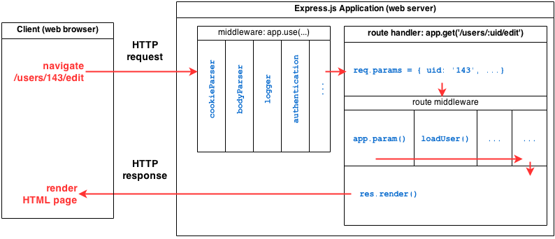
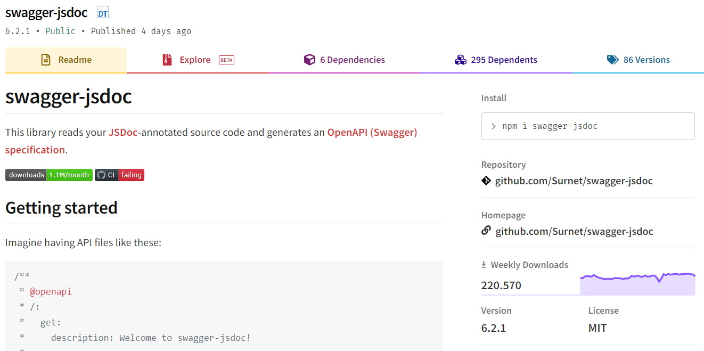

# **Implementing WebAPIs with Express.js**

Software Engineering - Lab

#### Marco Robol - marco.robol@unitn.it

---

# Contents

- How to implement a web service with [Express.js](https://expressjs.com/it/) web framework.
  `$ npm install express`

---

<!-- # Questions and answers


--- -->

## Where are we headed? ... a web service backend

```javascript
// https://github.com/unitn-software-engineering/EasyLib/blob/master/app/books.js
router.get('', async (req, res) => {
    // https://mongoosejs.com/docs/api.html#model_Model.find
    let books = await Book.find({});
    books = books.map( (book) => {
        return {
            self: '/api/v1/books/' + book.id,
            title: book.title
        };
    });
    res.status(200).json(books);
});
```

---

> ## A server with plain Node.js *http module*
> 
> We can create a basic web server in Node.js using the standard *http module*.

> ```javascript
> var http = require('http');
> var port = 3000;
> 
> var requestHandler = function(request, response) {
>   const { method, url, headers } = request;
>   console.log(request.url);
>   response.end('Hello World!');
> }
>                                                                                         //
> var server = http.createServer(requestHandler);
> server.listen(port);
> ```
> 
> Open [http://localhost:3000](http://localhost:3000) in a browser (`ctrl+c` in the terminal to end the execution). https://nodejs.org/en/docs/guides/anatomy-of-an-http-transaction/

---

# *Hello world* in Express.js

*Express is a minimal and flexible Node.js web application framework that provides a robust set of features for web and mobile applications.* (Source: https://expressjs.com/).

`$ npm install express`

```javascript
var express = require('express');
var app = express();

// Handling GET requests
app.get('/', function(req, res){ 
  res.send('Hello World!');
});
                                                                                        //
app.listen(port, function() {
  console.log('Server running on port ', 3000);
});
```

> TODO Test from the browser

---

## **Routing** with Express
> https://expressjs.com/en/starter/basic-routing.html

Route definition takes the following structure: `app.METHOD(PATH, HANDLER)`:

- we can listen to specific http verbs (`app.get`, `app.post`, `app.delete`, ...)
- we can listen to specific routes (`app.get('/books', handler)`)
- we can have variables in the path (`app.get('/books/:id', handler)`)

How to implement handlers...

---

## **Handling requests** in Express

> Handling requests parameters - https://expressjs.com/en/4x/api.html#req:

```javascript
// Handling GET requests
app.get('/books/:id', function(req, res){ 
  console.log(req.params, req.params.id)  // path parameters
  console.log(req.query)                  // query parameters
  console.log(req.headers)                // header parameters
  console.log(req.url)
  // res.status(200).send('Here is the book!');  
});
// Handling POST requests
app.post('/books', function(req, res){ 
  console.log(req.headers)
  console.log(req.params)
  // res.status(201).send('New book created!');                                     //
});
```

> TODO Try with postman

---

## **Parsing body** of the request

To access the body of a request we need a middleware that concatenate chunks from the stream and parse it for us. Express.js now comes with built-in `body-parser` middleware.

```javascript
// Parsing JSON:
app.use(express.json());

// Parsing form data (URL-encoded):
app.use(express.urlencoded());

//After this, body can be accessd directly using `req.body` as a keys-values object;
app.post('/books', function(req, res){ 
  console.log(req.body.title)
  console.log(req.body.author)
});
```

---

## Handling **response** in Express

> https://expressjs.com/it/api.html#res

```javascript
// text of html
res.status(200).send('text')
// json
res.json({ user: 'tobi' })
// file
res.sendFile('/absolute/path/to/404.png')                                  //
```

**Location header** - In RESTful APIs, a POST request should respond with an HTTP header 'Location' with a link to the newly created resource:
```javascript
app.post('/api/products', function (req, res) {                                       //
  res.location("/api/products/" + product.id);
}
```

---

### Sending HTTP **status codes**


```javascript
res.sendStatus(404) // status code
res.status(404).sendFile('/absolute/path/to/404.png') // chainable status code
res.status(201).json(body-of-the-response);
```

> Using status codes in RESTful APIs:
> https://www.restapitutorial.com/httpstatuscodes.html
> https://restfulapi.net/http-status-codes/
> 1xx: Informational; 2xx: Success; 3xx: Redirection; 4xx: Client Error; 5xx: Server Error

---

## Using Postman to test our web server

> https://www.postman.com/

Play with Postman, submit example requests and analyse what arrives to the server.

- Build your request in Postman - Consider that we are listening to two different routes `users` and `books`, on different HTTP verbs (post and get).
- Specify different **headers** `req.headers` and **query** `req.query` parameters.
- Send a json encoded **body** and try json body-parser to access `req.body`.

---

# What are middlewares, and how do they work? ...


> Figure by [hannahhoward](https://gist.github.com/hannahhoward/fe639ca2f6e95eaf0ede34a218e948f9)

---

## Serving static files with the `static` middleware
> https://expressjs.com/en/starter/static-files.html

Manually would require to: 1) Check requested URL, 2) Read the file, 3) Set response.

```javascript
var express = require('express');
var app = express();
                                                                                          //
// Serving static files
app.use(express.static('public'));

app.get('/hello', function(req, res){ 
  res.send('Hello World!');
});

app.listen(port, function() {
  console.log('Server running on port ', 3000);
});
```

---

## Serving static files

Run the script and then open [http://localhost:3000](http://localhost:3000) in your browser. What happens when you request the following?:
- [http://localhost:3000/hello](http://localhost:3000/hello)
- [http://localhost:3000/index.html](http://localhost:3000/index.html)
- [http://localhost:3000/image1.jpg](http://localhost:3000/image1.jpg)

To mount the `static` middleware under a given path e.g.`/public`:
```javascript
app.use('/public', express.static('./assets'));
```

---

## Serving *openAPI* with [Swagger UI Express](https://www.npmjs.com/package/swagger-ui-express)

This module allows you to serve swagger-ui generated API docs from express, based on a swagger.yaml file.  `npm install swagger-ui-express`

```javascript
import swaggerUi from 'swagger-ui-express';
import Path from 'path';
import { readFileSync } from 'fs';
import yaml from 'js-yaml';

// Determine __dirname in ES module scope
const __filename = fileURLToPath(import.meta.url);x
const __dirname = Path.dirname(__filename);

// Load OpenAPI (Swagger) document
const swaggerDocument = yaml.load(readFileSync(Path.join(__dirname, '..', 'oas3.yaml'), 'utf8'));
app.use('/api-docs', swaggerUi.serve, swaggerUi.setup(swaggerDocument));
```

---

## EasyLib

Web service for the management of book lendings to students.

> Repository: https://github.com/unitn-software-engineering/EasyLib
> APIs documentation: https://easy-lib.onrender.com/api-docs

---

# Questions?

marco.robol@unitn.it

---

# [swagger-jsdoc](https://www.npmjs.com/package/swagger-jsdoc)



---

This library reads your JSDoc-annotated source code and generates an OpenAPI (Swagger) specification. Imagine having API files like these:

```javascript
/**
 * @openapi
 * /:
 *   get:
 *     description: Welcome to swagger-jsdoc!
 *     responses:
 *       200:
 *         description: Returns a mysterious string.
 */
app.get('/', (req, res) => {
  res.send('Hello World!');
});
```

---

The library will take the contents of @openapi (or @swagger) with the following configuration:

```javascript
const swaggerJsdoc = require('swagger-jsdoc');

const options = {
  definition: {
    openapi: '3.0.0',
    info: {
      title: 'Hello World',
      version: '1.0.0',
    },
  },
  apis: ['./src/routes*.js'], // files containing annotations as above
};

const openapiSpecification = swaggerJsdoc(options);
```

The resulting openapiSpecification will be a swagger validated specification.

---

# swagger-ui-express and swagger-jsdoc

Swagger specification auto-generated and served from express.

```javascript
const swaggerUI = require('swagger-jsdoc')
const swaggerJsDoc = require('swagger-ui-express')

const swaggerOptions = {
  definition: {
    openapi: '3.0.0',
    info: {
      title: 'Hello World',
      version: '1.0.0',
    },
  },
  apis: ['./src/routes*.js'], // files containing annotations as above
};

const swaggerDocument = swaggerJsDoc(swaggerOptions);
app.use('/api-docs', swaggerUi.serve, swaggerUi.setup(swaggerDocument));
```
