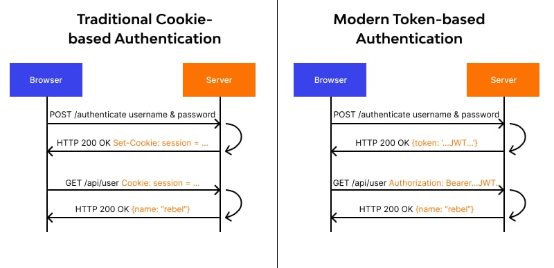
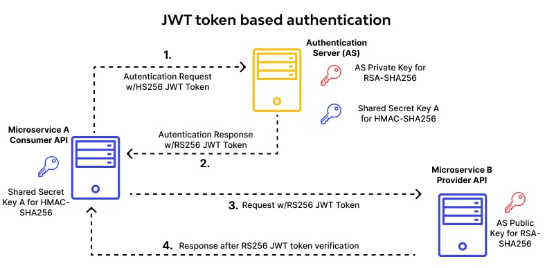
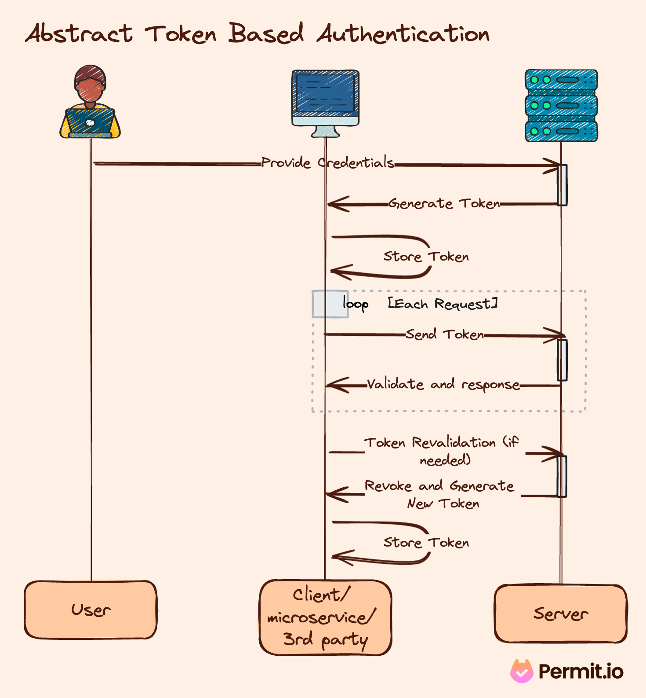

# **Authentication**

Software Engineering - Lab

#### Marco Robol - marco.robol@unitn.it

*Academic year 2024/2025*

---

# Contents

- Authentication and Access Control
  - RESTful is Stateless (no session)
  - Token-based
  - What is a JWT token?
  - Authentication on RESTful EasyLib

- Implementation in Express.js (EasyLib)
  - Authentication endpoint APIs
  - Authorization middlewares

---

# Interactions with REST APIs are stateless!

Stateless interaction means: **no sessions**! To implement access control, we should rely on a different mechanism, such as, **token-based access**.

- **Authentication** - **Who** you are

- **Authorization** - **What** you can do

> https://blog.restcase.com/4-most-used-rest-api-authentication-methods/

---



> https://www.wallarm.com/what/token-based-authentication

---

## Token-based Authentication

> https://blog.restcase.com/4-most-used-rest-api-authentication-methods/

Bearer authentication (also called token authentication) is an HTTP authentication scheme that involves security tokens called bearer tokens.

The name “Bearer authentication” can be understood as “give access to the bearer of this token.” The bearer token allowing access to a certain resource or URL and most likely is a cryptic string, usually generated by the server in response to a login request.

The client must send this token in the Authorization header when making requests to protected resources: `Authorization: Bearer <token>`

The Bearer authentication scheme was originally created as part of OAuth 2.0 in RFC-6750 but is sometimes also used on its own.

---

## What is a JWT token?


Play with JSON Web Tokens at [jwt.io](https://jwt.io/)

---



> https://www.wallarm.com/what/token-based-authentication

---

# Let's try authenticate on EasyLib RESTful token-based authentication

#### **Authenticate** and get a new token

- Send a `POST` request to `/api/v1/authenticate` with body `{name: 'admin', password: '123'}` encoded as `json` or `x-www-form-urlencoded`
- Try at https://easy-lib.onrender.com/api/v1/authenticate

#### Send the token to get **authorized**

- Send the token in the **HEADER**: `x-access-token`
  - or in the **HEADER**: `Authorization: Bearer <token>`
  - or as a **URL** parameter: `/api/v1/booklendings?token=YOUR_TOKEN`
- Try this at https://easy-lib.onrender.com/api/v1/booklendings

---



> https://www.permit.io/blog/what-is-token-based-authentication

---

# Implementation in EasyLib

> **EasyLib** https://github.com/unitn-software-engineering/EasyLib
> *VueFrontend* - https://github.com/unitn-software-engineering/EasyLibVue
> Demo APIs - https://easy-lib.onrender.com/api/v1
> Demo Basic Frontend - https://easy-lib.onrender.com
> Demo Vue Frontend - https://easy-lib.onrender.com/EasyLibApp or https://unitn-software-engineering.github.io/EasyLibApp/

JWT token authentication for Express JS via Middlewears: https://medium.com/ms-club-of-sliit/jwt-bearer-token-authentication-for-express-js-5e95bf4dead0

Install JWT module for Node.js `$ npm install jsonwebtoken`

---

# Authenticate user and sign a new token

`\app\authentication.js` 

```javascript
router.post('', async function(req, res) {
  let user = await Student.findOne({ email: req.body.email }).exec()

  if (!user)                            res.json({success:false,message:'User not found'})
  if (user.password!=req.body.password) res.json({success:false,message:'Wrong password'})

  // user authenticated -> create a token
  var payload = { email: user.email, id: user._id, other_data: encrypted_in_the_token }
  var options = { expiresIn: 86400 } // expires in 24 hours
  var token = jwt.sign(payload, process.env.SUPER_SECRET, options);

  res.json({ success: true, message: 'Enjoy your token!',
    token: token, email: user.email, id: user._id, self: "api/v1/" + user._id
  });
});
```

```javascript
app.use('/api/v1/authentications', authentication);
```

---

# Signing a token in EasyLib

```javascript
var token = jwt.sign(payload, process.env.SUPER_SECRET, options);
```

JWT secret passphrase used to sign the token is not hardcoded in the src code but taken from the system variable `SUPER_SECRET`. Never commit passwords or configurations in the source code!

Locally, we need to set our `SUPER_SECRET` system variable before running our application. But how?

---

# Dotenv - www.npmjs.com/package/dotenv

**Dotenv** (`$ npm install dotenv`) loads values from `.env` file and made them available within the application as environment variables in `process.env.*`

```javascript
SUPER_SECRET="islab" // .env file to be ignored by git; see `.gitignore`
```

- **Loading** `dotenv` within the source code.
  ```javascript
  require('dotenv').config()
  ```

- **Preloading** `dotenv` when invoking Node.js with --require (-r) option. By doing this, you do not need to load dotenv in your application code. `$ node -r dotenv/config your_script.js` or `$ npm run dev` using a script defined in `package.json`:
  ```json
    "scripts": {
      "dev": "node -r dotenv/config index.js", ...
  ```

---

# Protecting routes in Express with Middlewares

Require authentication only on specified routes
```javascript
app.use('/api/v1/students/me', tokenChecker);  // token validation middleware
app.use('/api/v1/booklendings', tokenChecker); // token validation middleware
// after tokenChecker apply resource routing
app.use('/api/v1/booklendings', booklendings); // resource router middleware
```

Position of token validation middleware is important!
```javascript
// Non-protected routes e.g.
app.use('/api/v1/authentications', authentication);
app.use('/api/v1/books', books);

app.use(tokenChecker); // Token validation middleware; Applies on every routes after this point
// Protected routes e.g.
app.use('/api/v1/booklendings', booklendings);
```
---

## Token validation middleware `\app\tokenChecker.js`

If token is validated, request is authorized.

```javascript
const tokenChecker = function(req, res, next) {
  // header or url parameters or post parameters
  var token = req.body.token || req.query.token || req.headers['x-access-token'];

  if (!token) res.status(401).json({success:false,message:'No token provided.'})

  // decode token, verifies secret and checks expiration
  jwt.verify(token, process.env.SUPER_SECRET, function(err, decoded) {
    if (err) res.status(403).json({success:false,message:'Token not valid'})
    else {
      // if everything is good, save in req object for use in other routes
      req.loggedUser = decoded;
      next();
    }
  });
};
```

---

# Questions?

marco.robol@unitn.it

---

# Google Authentication

https://developers.google.com/identity/gsi/web/guides/overview?hl=it

```javascript
const client = new OAuth2Client( GOOGLE_CLIENT_ID );
async function verify( token ) {
	const ticket = await client.verifyIdToken({
		idToken: token,
		// audience: GOOGLE_CLIENT_ID,  // Specify the CLIENT_ID of the app that accesses the backend
		// Or, if multiple clients access the backend:
		//[CLIENT_ID_1, CLIENT_ID_2, CLIENT_ID_3]
	});
	const payload = ticket.getPayload();
	const userid = payload['sub'];
	// If the request specified a Google Workspace domain:
	// const domain = payload['hd'];
	return payload;
}
```
> https://developers.google.com/identity/gsi/web/guides/verify-google-id-token?hl=it#node.js


