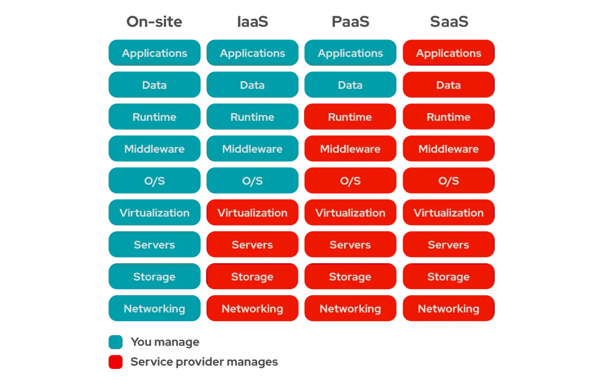
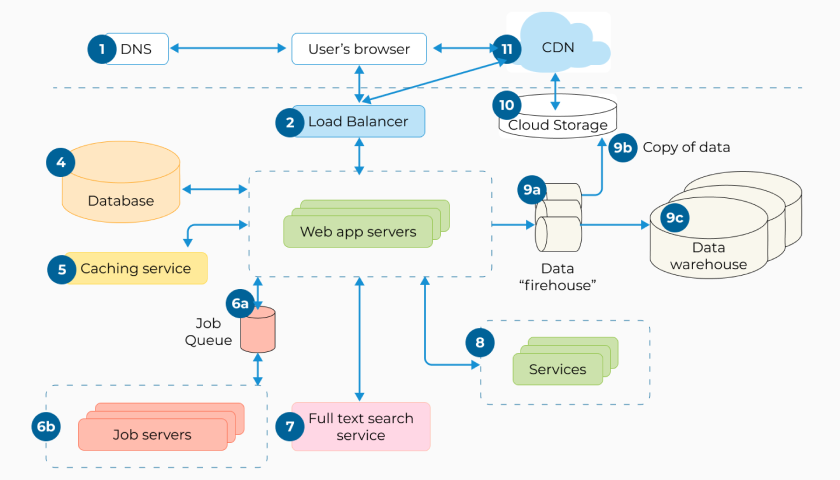
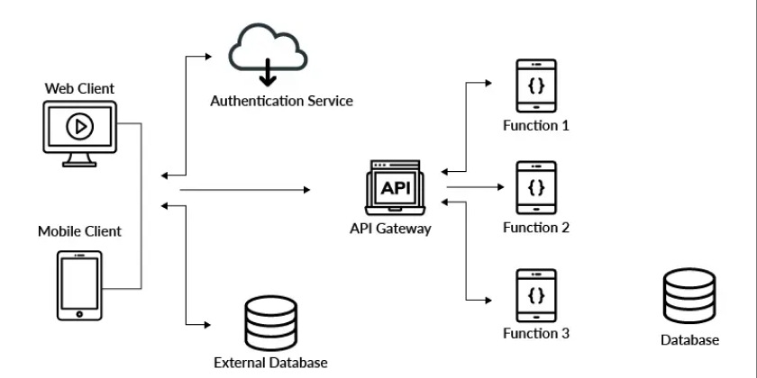

# **Deploying**

Software Engineering - Lab

#### Marco Robol - marco.robol@unitn.it

---

# Contents of today class

In today's class, we will see how to deploy your application on the cloud at `Render.com`

> **EasyLib repos**
> BackEnd - https://github.com/unitn-software-engineering/EasyLib
> Vue FrontEnd - https://github.com/unitn-software-engineering/EasyLibVue

> **EasyLib deploys**
> Basic Frontend - https://easy-lib.onrender.com/
> Vue Frontend - https://easy-lib.onrender.com/EasyLibApp/

---

# IaaS, PaaS, and SaaS in the Cloud

> Choose between IaaS, PaaS, and SaaS - https://developer.ibm.com/articles/cl-best-practices-deploying-apps-in-cloud/

> IaaS vs PaaS: Che Differenza c’è? https://kinsta.com/it/blog/iaas-vs-paas/

---

Nowadays we have a mix of statically-rendered web pages, web applications and services: **Software as a Service**, ***Platform as a Service***, ***Infrastructure as a Service***.



---

# Modern Web Application Architecture



> https://integrio.net/blog/modern-web-application-architecture

---

> #### Serverless Architecture
> 
> > In this architecture, the backend is built using cloud-based solutions, such as AWS or Azure. Each function is responsible for tasks like registering users or sending email notifications. It is highly scalable but difficult to manage and debug.
> > https://integrio.net/blog/modern-web-application-architecture
> 
> 
> 

---

# Design choices for this lab

- One RESTful **Web Service** implemented in Node.js. This will be deployed on the cloud on render.com or a similar **PaaS**.

- One frontend developed in Vue.js as a **Single-Page Applications** (SPAs) e.g. Gmail, Trello, Spotify, and Twitter. Still, additional pages are allowed.

    - No Server-Side Rendered Application (SSR) e.g. WordPress, Airbnb.

    - Served as static content through CDN (Content Delivery Networks delivers content from the closest server). e.g. Cloudflare, Akamai, and Amazon CloudFront.

---

## Render: Cloud Application Hosting for Developers

> Render is a unified cloud to build and run all your apps and websites with free TLS certificates, global CDN, private networks and auto deploys from Git. https://render.com/

> It’s easy to deploy a Web Service on Render. Link your GitHub or GitLab repository and click Create Web Service. Render automatically builds and deploys your service every time you push to your repository. Our platform has native support for Node.js, Python, Ruby, Elixir, Go, and Rust. If these don’t work for you, we can also build and deploy anything with a Dockerfile. https://render.com/docs/web-services

---

## Prepare and Deploy your **Backend** Application 

1. Setup your *package.json* with dependencies and buid/start scripts.
```json
  "scripts": {
    "start": "node index.js", ...
```
2. Set listening port of your application:
```javascript
const PORT = process.env.PORT || 8080
```
3. On render.com Dashboard **Create a new Web Service** from github repository
    1. **Setup** Build Command and Start Command
    1. **Configure Environment** e.g. DB_URL and SUPER_SECRET

---

# Front-end deployment

If your frontend does not require a build process (e.g. pure html-js) you don't this step!

> EasyLib Front-end Repository
> https://github.com/unitn-software-engineering/EasyLibVue

> EasyLib deployed front-end application
> https://unitn-software-engineering.github.io/EasyLibApp/

---

## Prepare and Deploy your **FrontEnd** Application (Vue.js)


1. Setup your *package.json* with dependencies and buid/start scripts.
```json
  "scripts": {
    "build": "vite build", ...
```
2. Read your APIs url from environment: `const API_URL=process.env.API_URL;`
3. On render.com Dashboard **Create a new Static Site** from github repository
    1. **Setup** Build Command and Start Command
    1. **Configure Environment** e.g. DB_URL and SUPER_SECRET

---

## Frontend already in the same repository as your webAPIs

Alternativley, if your FrontEnd (Vue.js) is in the same repo with the backend, you can build both togheter and then serve the `dist` folder from your Express.js app. 

`EasyLib\app\app.js`
```javascript
// Serving frontend files from process.env.FRONTEND
app.use('/', express.static(process.env.FRONTEND || 'static'));
// If request not handled, try in ./static
app.use('/', express.static('static'));
// If request not handled, try with next middlewares ...
```

`EasyLib\.env` These configurations are used only locally, never commit these settings!
```yaml
# Path to external frontend - If not provided, basic frontend in static/index.html is used
FRONTEND='./Frontend/dist'
```

---

> ## Build and serve Vue app on *GitHubPages* pages.github.com
> 
> When ready to ship app to production, run the following: `npm run build`. This generates minified html+javascript frontend in `.\dist` folder. Create a **dedicated repository for hosting** on github to host your frontend, then push your built frontend manually or with a script `EasyLibVue\deploy.sh`: 
> 
> ```bash
> npm run build # build Vue app
> cd dist # navigate into the build output directory
> git init
> git add -A
> git commit -m 'deploy'
> git push -f https://github.com/unitn-software-engineering/EasyLibApp.git master:gh-pages
> ```
> 
> ***MUST be a repository dedicated to hosting, different from your Frontend repository!***
> Run `.\deploy.sh` (In case of errors, manually delete the folder `.\dist`).
> 
> > https://cli.vuejs.org/guide/deployment.html#github-pages

---

# Questions?

marco.robol@unitn.it